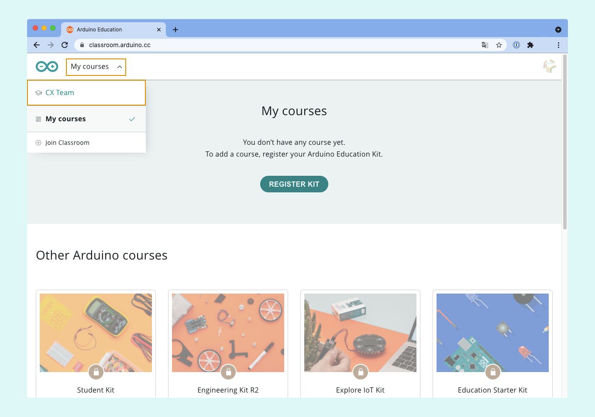
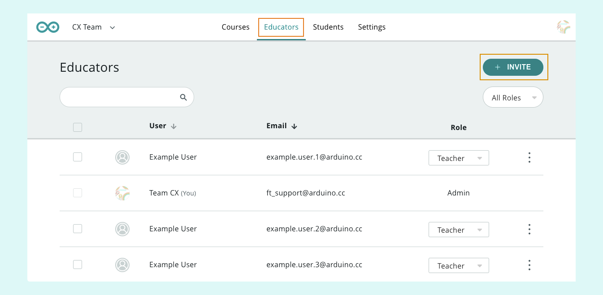

Learn how to invite educators (teachers or admins) and students to your classroom for Arduino Education.

---

> **Note:** Read about [access control](#access) before inviting users to your classroom.

## Open your classroom

1. Go to the [Arduino Courses page](https://classroom.arduino.cc/). If prompted, sign in to your Arduino account.
2. Click on "My courses".
3. Select your classroom in the dropdown menu.

## Invite Educators

Open the **Educators** tab, then click on **INVITE**.

* Enter the educator's email in the first field. An Arduino account has to be created with the email, otherwise the user will be given student status.
* Select an educator role in the second field ([learn more about roles](https://support.arduino.cc/hc/en-us/articles/4405753330706-Admin-and-teacher-roles-in-Classroom)).
* Multiple invites can be sent by clicking **ADD MORE**.

Click **INVITE** to send the invite. If the button is grayed out, confirm that the user has not already been added as a student. In this case, you need to first remove the user before sending the educator invite.

## Invite students

Open the **Students** tab, then click on **INVITE**.

You can either copy the code and share it with your students or invite them automatically by entering their email addresses in the _Invite students_ field and clicking **INVITE**.

Click **INVITE** to send the invite. If the button is grayed out, confirm that the user has not already been added as an educator. In this case, you need to first remove the user before sending the student invite.

<h2 id="access">Controlling access to your classroom</h2>

If an Arduino account is _not_ associated with the email, the invite link will include a reusable invite code (the same code that can be copied from the student invite view). Only invite trusted users with this method since this code can be shared with other users.

## Troubleshooting

### If the invite button is grayed out

Check that the user has not already been added as a different user type, e.g. a student if you're trying to add an educator. In this case, you need to first remove the user before sending the invite. Click the three dots to the right in the user row, and select Remove.

### If the invite is not received

* Have the recipient check their spam folder.
* Ensure that the network allows receiving outside email.
