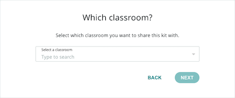
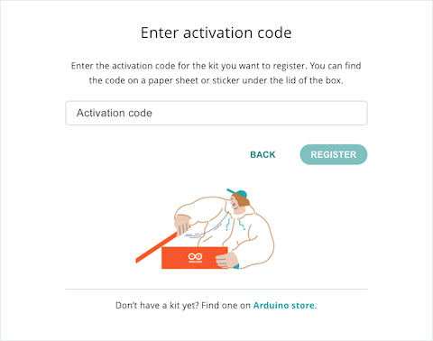

Learn how to activate your kit and access the online learning content for your Arduino Education kit.

---

## 1. Getting started

Go to the [Arduino Education kit registration page](https://classroom.arduino.cc/registration).

> If prompted, sign in to your Arduino account. Then click REGISTER KIT.

## 2. Who should have access to this kit?

**If you are part of one or more classrooms**, you will be asked to choose whether to share it with a classroom or add it to your personal collection.

* Kits added to your personal collection can be shared with a classroom later.
* If the classroom is disbanded, any kit you activated will be transferred back to your personal collection.

If you are part of **multiple classrooms**, you will be asked to select one. Click on the bar to open the list, and select a classroom.

## 3. Enter activation code

Enter the activation code for the kit you want to register.

You can [find the code on a paper sheet or sticker under the lid of the box](https://support.arduino.cc/hc/en-us/articles/4402999992850).

## Troubleshooting

* [Find the activation code for your kit](https://support.arduino.cc/hc/en-us/articles/4402999992850-Where-is-the-activation-code-for-my-kit-)
* [If the kit activation code does not work](https://support.arduino.cc/hc/en-us/articles/360017549580-If-the-kit-activation-code-does-not-work)
