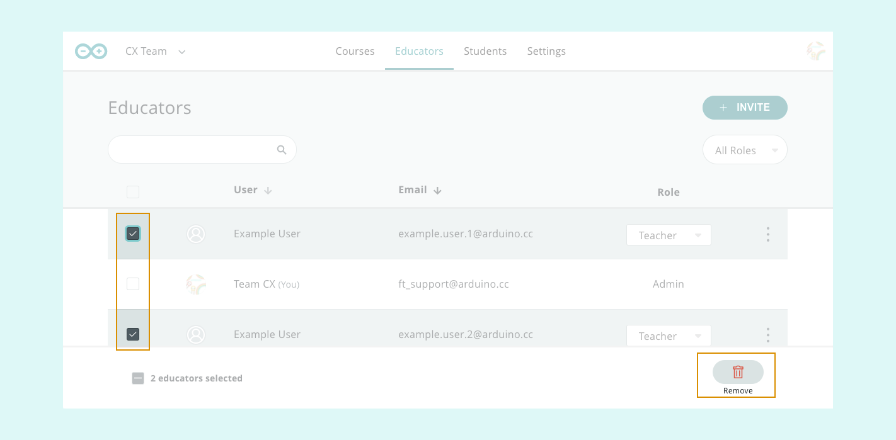
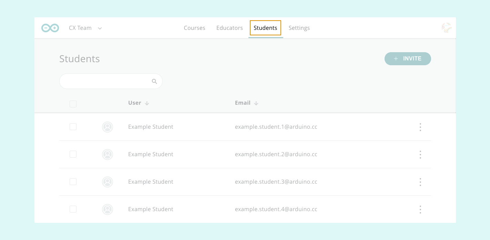
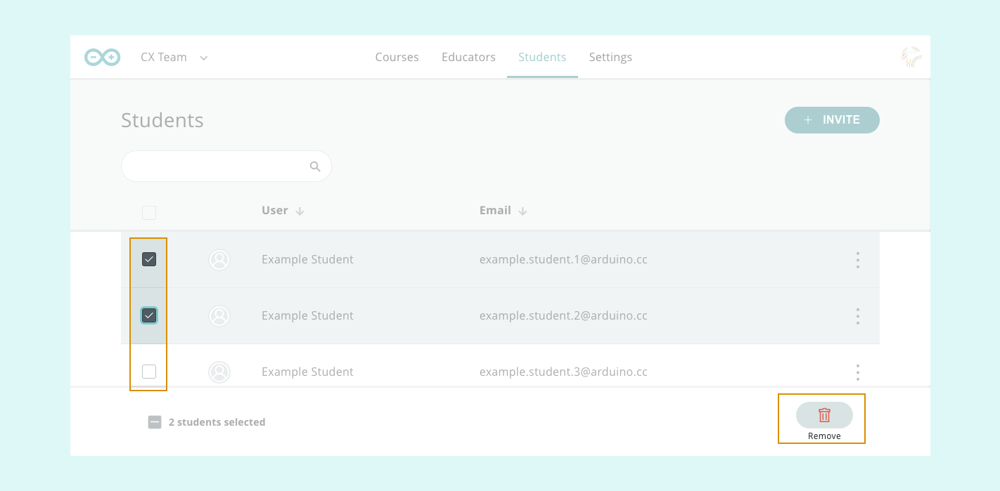

Learn how to remove educators (teachers or admins) and students from your classroom for Arduino Education.

---

## Open your classroom

1. Go to the [Arduino Courses page](https://classroom.arduino.cc/). If prompted, sign into your Arduino account.
2. Click on "My courses".
3. Select your classroom in the dropdown menu.

## Removing Educators

Open the **Educators** tab.

### Removing a single Educator

1. Click on the three dots.
2. Click **Remove**.

### Removing a multiple Educators

1. Select educators by ticking the checkboxes.
2. Click **Remove** on the right of the bottom bar.

## Removing Students

Open the **Students** tab.

### Removing a single Student

1. Click on the three dots.
2. Click **Remove**.

### Removing multiple Students

1. Select students by ticking the checkboxes.
2. Click **Remove** on the right of the bottom bar.

