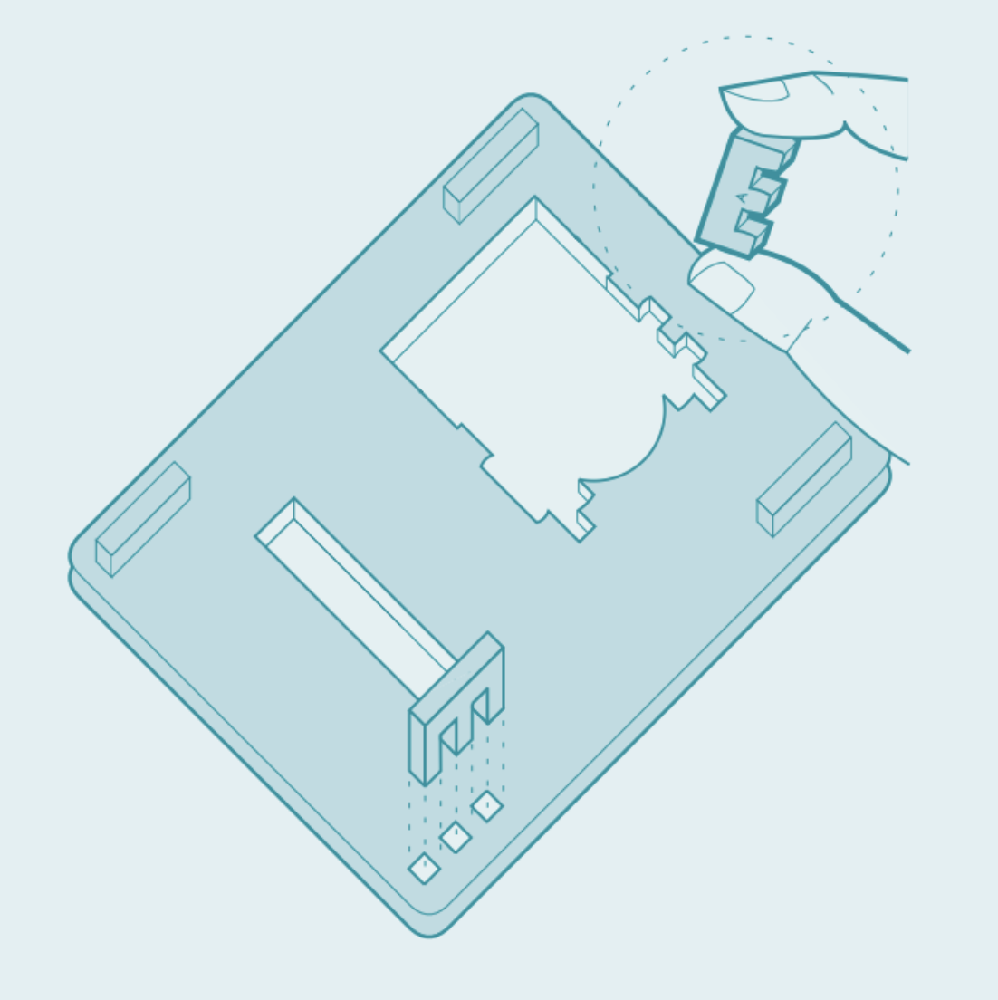
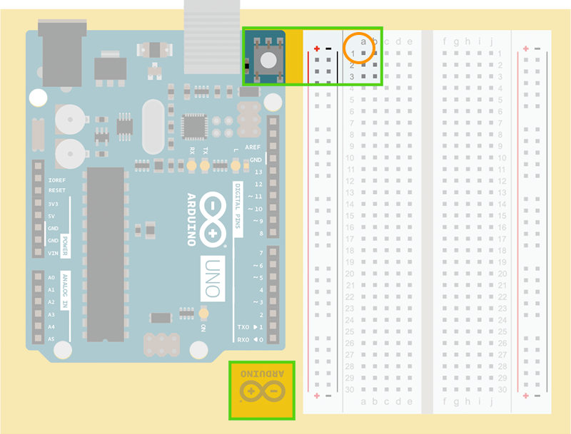

The **project board** is a pre-cut, easy-to-assemble plastic base that can hold an Arduino UNO and a breadboard, securely keeping your circuit in one place.

The project board is included with the following kits:

* [Arduino Starter Kit](https://store.arduino.cc/products/arduino-starter-kit-multi-language)
* [Education Starter Kit](https://www.arduino.cc/education/edu-starter-kit)
* [Arduino Student Kit](https://www.arduino.cc/education/student-kit)

---

## What you'll need

* Arduino UNO
* Breadboard
* The orange, plastic base
* 3 x nuts (M3)
* 3 x screws (M3 x 12 mm)

> [!TIP]
> The nuts and scews are included with the kit and can be found in the electronic components box.

---

## Assembly instructions

<video width="800" height="450" controls>
  <source src="https://www.datocms-assets.com/42182/1615389080-student-kit-mounting-the-project-board-4.mp4" type="video/mp4">
  Your browser does not support the video tag.
</video>

In this section:

1. [Separate the plastic pieces](#separate-the-plastic-pieces)
2. [Attach the feet](#attach-the-feet)
3. [Place the UNO and breadboard on the plastic base](#place-the-uno-and-breadboard-on-the-plastic-base)
4. [Attach the UNO and breadboard to the plastic base](#attach-the-uno-and-breadboard-to-the-plastic-base)

### 1. Separate the plastic pieces {#separate-the-plastic-pieces}

1. Take the plastic sheet and carefully separate the pieces from the sheet by twisting and pressing on them.

2. When you're finished, you should have the following pieces:

    

3. The four pieces marked "A" are the "feet" for the project board. The other pieces may be used in projects included with your kit—put them somewhere you can find them later.

   > [!TIP]
   > Trim off any plastic that is remaining where the pieces connect to the sheet.

### 2. Attach the feet {#attach-the-feet}

1. Flip the plastic base over so the Arduino logo is face-down.
2. Insert the four plastic feet (marked "A") into the holes at each corner of the base.

   

3. Turn the base right-side up again.

### 3. Place the UNO and breadboard on the plastic base {#place-the-uno-and-breadboard-on-the-plastic-base}

Before you continue, understand how the UNO board and breadboard should be placed on the plastic base:

1. If your UNO board came with a small transparent plastic base, remove it.

2. Place the Arduino UNO on the board. The reset button should face away from the Arduino logo.

3. Align the breadboard so that `a1` pin connector is next to the reset button on the UNO.

   

### 4. Attach the UNO and breadboard to the plastic base {#attach-the-uno-and-breadboard-to-the-plastic-base}

* **Attach the UNO board**
  Secure your Arduino UNO to the base using the three M3 bolts and nuts. The screw holes on the UNO should align with the three holes on the project board. Be careful not to overtighten.

    

    > [!IMPORTANT]
    > Do not insert a screw in the hole next to the reset button.

* **Attach the breadboard**

  1. Carefully peel off the adhesive backing from the breadboard.
  2. With the `a1` pin connector next to the reset button on the UNO, stick the breadboard onto the plastic base.

Your project board is now assembled.

[^1]: Instructions included in the Arduino Starter Kit projects book, pages 12-13.
[^2]: This image was mirrored in some early prints of the Arduino Starter Kit projects book.
