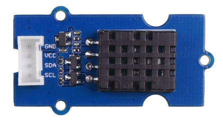

  <figure style="text-align: center;">
    
    <figcaption style="font-style: italic;">The DHT20 temperature and humidity sensor.</figcaption>
  </figure>

Support for the **DHT20** temperature and humidity sensor[^1] was added to the **Arduino_Sensorkit** library in version 1.0.10[^2]. Older versions of the library could not correctly read values from the sensor, resulting in `NaN` (Not a Number) values in the serial monitor output. To use a DHT20 sensor with the library, make sure to update to version 1.0.10 or later.

[^1]: <https://wiki.seeedstudio.com/Grove-Temperature-Humidity-Sensor-DH20/>

[^2]: <https://github.com/arduino-libraries/Arduino_SensorKit/releases/tag/v1.0.10>

Follow these steps to update the Arduino_Sensorkit library in Arduino IDE:

1. Click the  **Library Manager** button (or select _Tools > Manage Libraries_).

2. Search for "Arduino_SensorKit".

3. Make sure 1.0.10 or later is selected and click **Update**.

   

4. If you're asked whether you'd like to install library dependencies, click **Install all**.

5. Wait for the update process to finish.

The Web Editor uses the latest version of all libraries by default.
