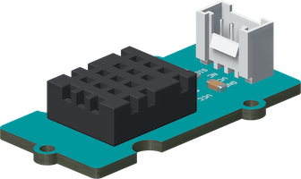
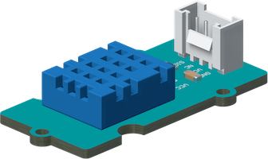
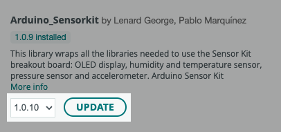

The Arduino Sensor Kit comes with one of these temperature and humidity sensors:

* DHT11 temperature and humidity sensor[^dht11]
* DHT20 temperature and humidity sensor[^dht20]

The DHT20 is a newer sensor with I<sup>2</sup>C support, but may require some configuration when used with the Arduino_SensorKit library.

[^dht11]: <https://wiki.seeedstudio.com/Grove-TemperatureAndHumidity_Sensor/>

[^dht20]: <https://wiki.seeedstudio.com/Grove-Temperature-Humidity-Sensor-DH20/>

---

## Identify which sensor you have

The easiest way to identify which sensor is in your kit, is by looking at the color of the sensor module:

<div style="display: flex; flex-direction: row; flex-wrap: wrap">
  <figure style="text-align: center;">
    
    <figcaption style="font-style: italic;">The DHT20 temperature and humidity sensor (black).</figcaption>
  </figure>
  <figure style="text-align: center;">
    
    <figcaption style="font-style: italic;">The DHT11 temperature and humidity sensor (blue).</figcaption>
  </figure>
</div>

---

## Using the DHT20 sensor

### Use Arduino_Sensorkit v1.0.10 or later

Support for the **DHT20** temperature and humidity sensor was added to the **Arduino_Sensorkit** library in version 1.0.10[^github]. Older versions of the library could not correctly read values from the sensor, resulting in `NaN` (Not a Number) values in the serial monitor output. To use a DHT20 sensor with the library, make sure to update to version 1.0.10 or later.

[^github]: <https://github.com/arduino-libraries/Arduino_SensorKit/releases/tag/v1.0.10>

Follow these steps to update the Arduino_Sensorkit library in Arduino IDE:

1. Click the  **Library Manager** button (or select _Tools > Manage Libraries_).

2. Search for "Arduino_SensorKit".

3. Make sure 1.0.10 or later is selected and click **Update**.

   

4. If you're asked whether you'd like to install library dependencies, click **Install all**.

5. Wait for the update process to finish.

The Web Editor uses the latest version of all libraries by default.

### Uncomment lines for the DHT20

The `Temp_and_Humidity.ino` example contains two lines of code that should be uncommented if you're using the DHT20 sensor.

The modified sketch looks like this:

```arduino
//#define DHTPIN 3 // By default its connected to pin D3, it can be changed, define it before the #include of the library
#include "Arduino_SensorKit.h"

//uncomment line below if using DHT20
#define Environment Environment_I2C

void setup() {
  //uncomment line below if using DHT20
  Wire.begin();
  Serial.begin(9600);
  Environment.begin();
}

void loop() {
  Serial.print("Temperature = ");
  Serial.print(Environment.readTemperature()); //print temperature
  Serial.println(" C");
  Serial.print("Humidity = ");
  Serial.print(Environment.readHumidity()); //print humidity
  Serial.println(" %");
  delay(2000);
}
```
