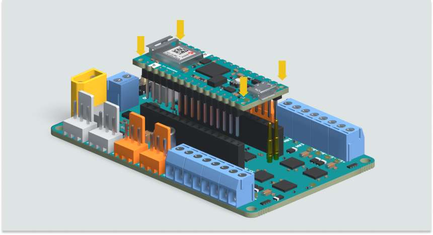
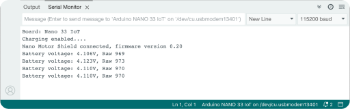
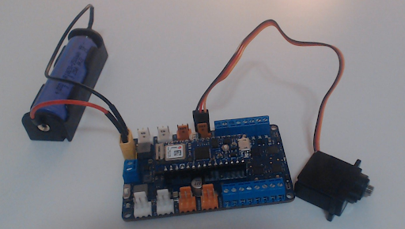
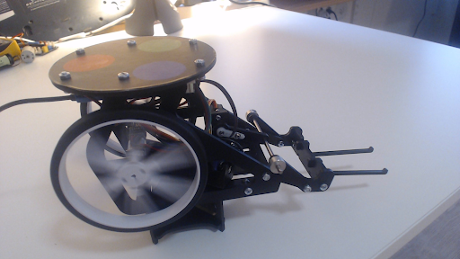
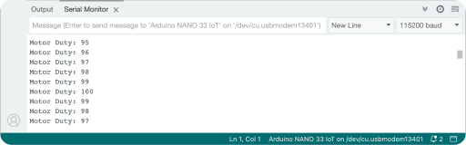

Learn how to determine if specific components in the Arduino Engineering Kit Rev2 (AEK R2) are functioning correctly or if they are faulty.

In this article:

- [Before running the tests](#before-running-the-tests)
- [Check the firmware version on the Nano Motor Carrier](#check-firmware-version-and-battery-voltage)
- [Check the voltage on the Li-ion battery](#check-firmware-version-and-battery-voltage)
- [Test the servo motors](#test-the-servo-motors)
- [Test the DC motors](#test-the-dc-motors)

---

## Before running the tests

1. Install the [ArduinoMotorCarrier library](https://www.arduino.cc/reference/en/libraries/arduinomotorcarrier/). (See [Add libraries to Arduino IDE](https://support.arduino.cc/hc/en-us/articles/5145457742236-Add-libraries-to-Arduino-IDE) for instructions)
2. Connect the Nano 33 IoT board to the Nano Motor Carrier.

    

3. Connect the Li-ion battery.
4. Turn on the power switch on the Nano Motor Carrier.
5. Connect the Nano 33 IoT to your computer.

---

## Check the firmware version and battery voltage

You can check the Nano Motor Carrier firmware version and/or the voltage of the Li-ion battery by following the steps below:

1. Follow the instructions in [Before running the tests](#before-running-the-tests).
2. In Arduino IDE, go to **File > Examples > ArduinoMotorCarrier > NanoMotorCarrier** and select the **Battery_Charging** sketch.
3. Enable `while (!Serial);` in line 10.
4. Open the Serial Monitor and set the baud rate to 115200.
5. Upload the sketch.
6. You should now be able to see information about the Nano Motor Carrier's firmware version and the battery voltage printed on the Serial Monitor.

    

---

## Test the servo motors

1. Follow the instructions in [Before running the tests](#before-running-the-tests).
2. In Arduino IDE, go to **File > Examples > ArduinoMotorCarrier > NanoMotorCarrier** and select the **ServoTest** sketch.
3. Connect the servo motor to one of the servo ports on the Nano Motor Carrier.

    

4. Comment out or delete `#include <Arduino_PMIC.h>` in line 1 since this library is not necessary for this test.
5. Comment out or delete `if (!PMIC.enableBoostMode()) {` in line 35, `Serial.println("Error enabling Boost Mode");` in line 36, and `}` in line 37, since these are not necessary for this test.
6. Upload the sketch.

Once done, the servo motor should loop continuously between clockwise and counterclockwise motion.

---

## Test the DC motors

1. Follow the instructions in [Before running the tests](#before-running-the-tests).
2. In Arduino IDE, go to **File > Examples > ArduinoMotorCarrier > NanoMotorCarrier** and select the **DCMotorTest** sketch.
3. Connect the DC motor to one of the motor ports on the Nano Motor Carrier. (Tip: To test the motors without the Rover moving, place it on an elevated object so its wheels can spin freely)

    

4. Upload the sketch.

Once done, the DC motor should loop between the duty cycles from -100 to 100 and back again, and the values printed in the Serial Monitor.

