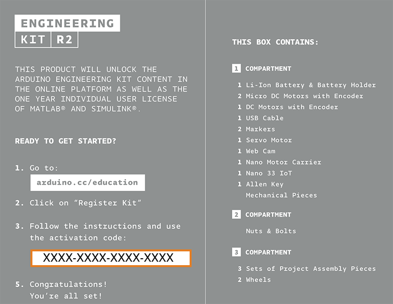
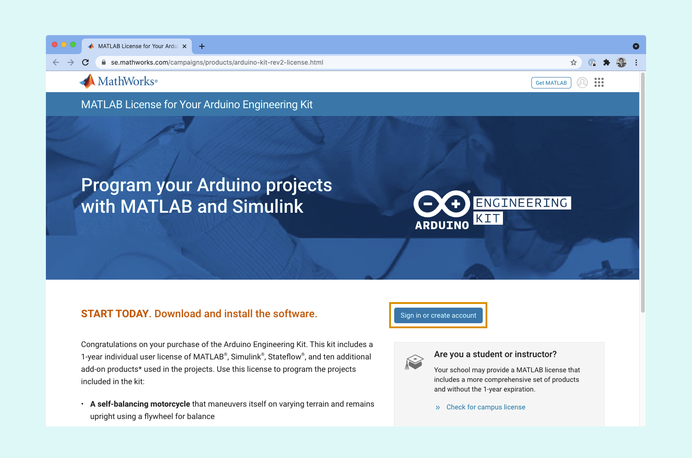
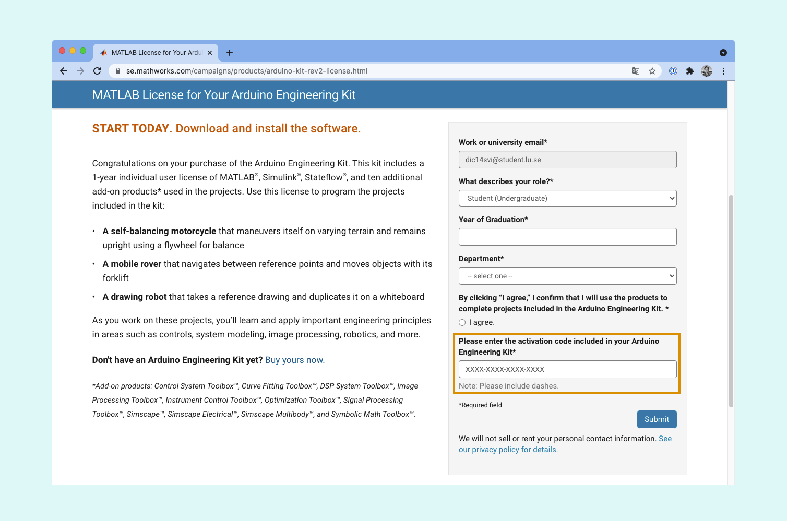

Learn how to activate the one-year individual license for MATLAB and Simulink from the Arduino Engineering Kit.

---

1. Find the activation code. It is printed on the information sheet inside the box.

   

2. Go to the [MathWorks Engineering Kit page](https://se.mathworks.com/campaigns/products/arduino-kit-rev2-license.html). If not signed in, click **Sign in or create account** and proceed with the instructions. Note that this is an individual license that can only be activated with one account.

   

3. Enter the activation code and click **Submit**.

   

Your license should now be activated. You may now [proceed with installation](https://se.mathworks.com/help/install/install-products.html) or if you decide to do so on a later date use [mathworks.com/mwaccount](https://se.mathworks.com/login/?uri=%2Fmwaccount%2F) and choose the license number that corresponds to the MathWorks Arduino Kit.
