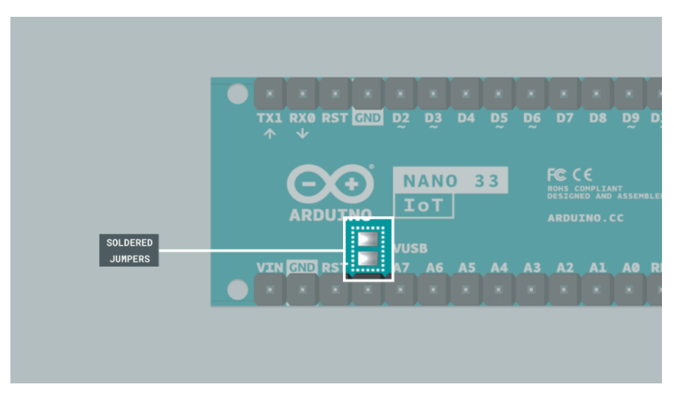

Devices included in the [Arduino Engineering Kit Rev2](https://store.arduino.cc/products/arduino-engineering-kit-rev2) can be replaced with devices bought individually from the Arduino Store, but some modification may be necessary.

## [Arduino Nano 33 IoT](https://store.arduino.cc/products/arduino-nano-33-iot-with-headers)

The board included in the kit has been modified to enable the **5 V pin**, so that the battery can be charged.

To use the board sold in the store, you need to solder the VUSB jumpers pictured below.

## [Arduino Nano Motor Carrier](https://store.arduino.cc/products/arduino-nano-motor-carrier)

The shield included in the kit has no modifications and can be replaced with the one sold in the store.
