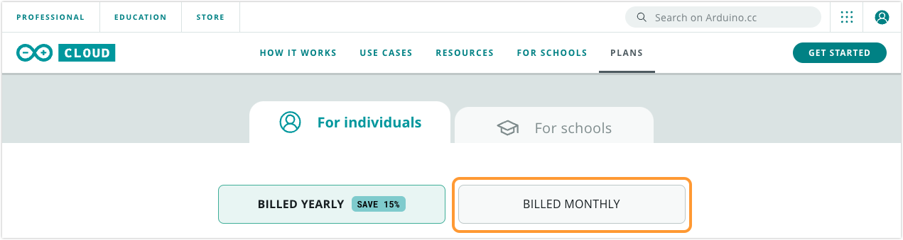
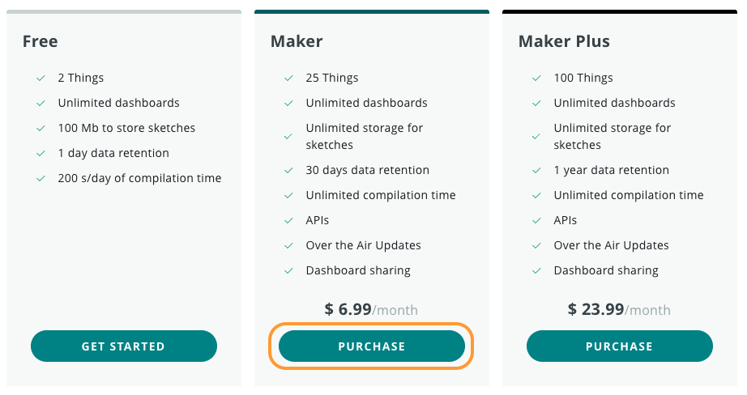
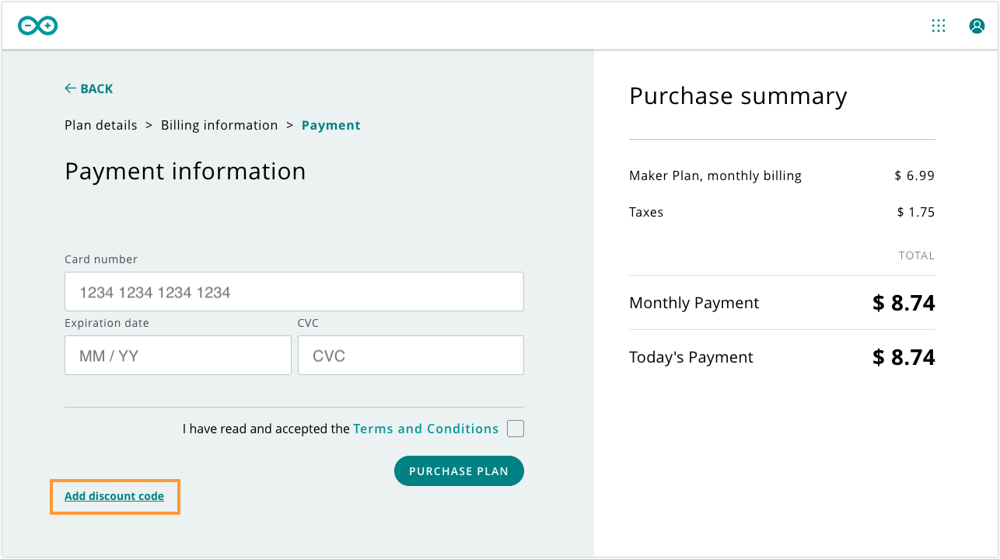
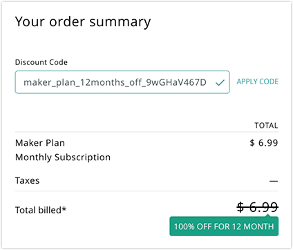

The [Arduino Oplà IoT Kit](https://store.arduino.cc/opla-iot-kit) comes with 12 free months of the Arduino Cloud Maker Plan. Follow the steps below to activate your discounted plan.

> If you already have an active paid plan, we recommend you wait until the end of your subscription period before changing to the Maker plan. If your currently active plan is a Maker plan, you will have to cancel it and sign up again to activate the discount code.

---

1. Go to the [Cloud store page](https://www.arduino.cc/cloud/plans).

2. In the _For individuals_ tab, select the **BILLED MONTHLY** option.

   

3. In the Maker plan column, click PURCHASE.

   

4. If you are not logged into your Arduino account, you will be taken to the login page. **Before proceeding, make sure you are logged into the account you want the code redeemed with.**

5. Add or update your billing information if needed, and click ADD PAYMENT INFORMATION.

6. Click on **Add discount code**.

   

7. Enter the code in the text field and click APPLY CODE if it is not automatically applied. Your discount will be applied in the purchase summary on the right.

   

8. Continue to activate the plan by entering your card information and clicking PURCHASE PLAN.

---

If you're having trouble, please check the following.

* Make sure the *Monthly* option is selected. The code is not valid for the yearly option.
* Make sure you've typed in the discount code correctly. The code is a combination of uppercase letters and numerals.
