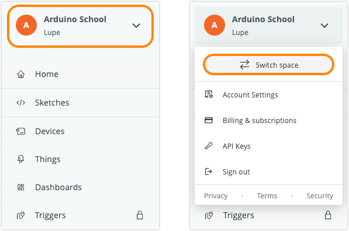
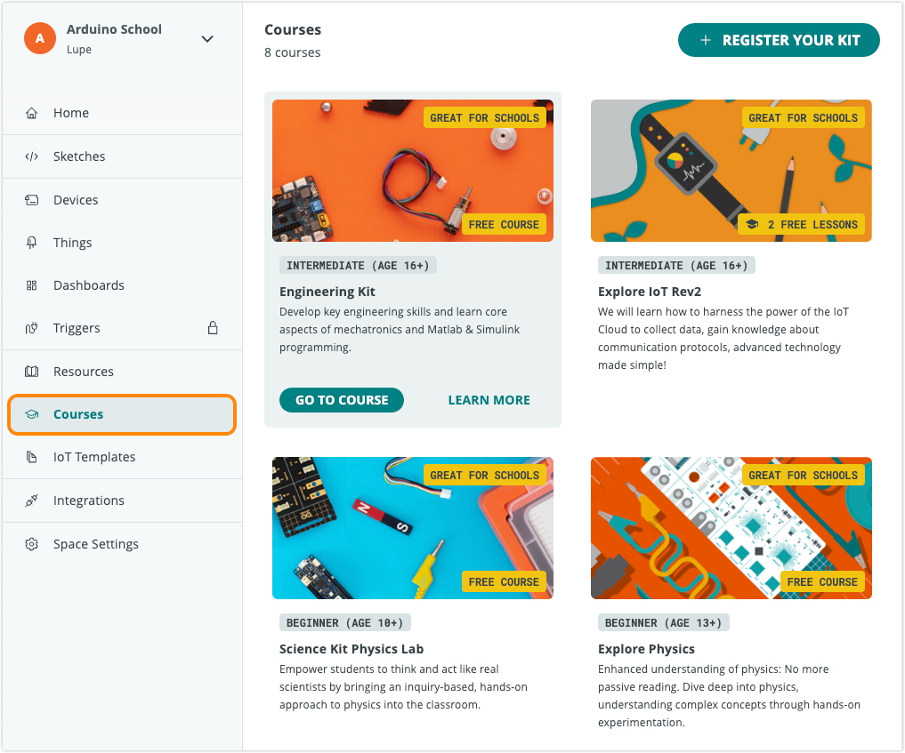

Learn how to access and share courses in Arduino Cloud.

In this article:

* [Unlock course access](#unlock-course-access)
* [View a course](#view-your-courses)
* [Create or join shared spaces](#create-or-join-shared-spaces)
* [Share a registered course with a space](#share-a-course)
* [Add members to a space](#add-members-to-a-space)

---

## Unlock course access

You can gain access to courses in different ways:

### Unlock with a Cloud plan

Any paid Cloud plan will grant access to all courses:

* **Individual plan:** When you sign up for a paid individual Cloud plan (Maker), you can access all courses when viewing your Private space.
* **School Plan:** When a shared space is upgraded with a School plan, all members of that space can access all courses when viewing that space.

To learn how to switch between spaces and view courses, see [View a course](#view-your-courses).

### Unlock with registration code

> [!IMPORTANT]
> To share access to the kit, it needs to be added to a shared space.
>
> If you need to transfer after it's been added to a space, please [contact us](https://www.arduino.cc/en/contact-us/).

Some kits include a **registration code**. Registering the kit unlocks permanent access to the course for that kit, and does not require an active Cloud plan.

When registering the kit, you can choose where to add the kit:

* Inside your Private space
* Add it to a shared space (School space)

To learn more about kit registration, see [Register an Arduino Education Kit](https://support.arduino.cc/hc/en-us/articles/4407393580818-Register-an-Arduino-Education-Kit).

### Free courses

Some courses may be available for free and are available by default in all course-enabled spaces.

---

## View a course

Follow these steps:

1. Go to [app.arduino.cc](https://app.arduino.cc/)

2. The name of the selected space is displayed at the top of the left sidebar.

3. To change the selected space, click on the space name and select **Switch space** in the menu.

   

4. Click the **Courses** tab in the leftmost sidebar to see the available courses.

   

5. Click on a course to open the content.

---

## Create or join shared spaces

### Create a new shared space

1. Go to [app.arduino.cc/space](https://app.arduino.cc/space)

2. Select **Shared space**.

3. Fill in additional information.

### Join a shared space

Depending on how you were invited, you can join a shared space in different ways:

* **Email invitation:** find the invitation email in your inbox and click JOIN NOW.

* **Shared link:**  If you received a direct link, click on it or enter it into your browser.

* **Shared code (for minor students):** minor students can use a code to join shared spaces. If a minor student does not belong to any Educational space, an orange banner will be shown in the sidebar when the student opens Arduino Cloud. Clicking on it will open a text box that allows the student to join the space by entering the code.

---

## Share a registered course with a space

When activating a kit using a **registration code**, you can share it with others by adding it to a School space (shared space for education).

> [!WARNING]
> To share a course with others, and for features like Teacher's Notes to work correctly, you must add the kit to a shared space.

1. Go to [app.arduino.cc](https://app.arduino.cc/)

2. Select the shared space in the top-left dropdown menu.

3. In the leftmost sidebar, click on the **Courses** tab.

4. Click on the **REGISTER YOUR KIT** button in the top-right corner.

5. Select whether you want to register a new kit, or if you want to share an already registered kit from your private space.

6. Proceed with the instructions.

To learn more about kit registration, see [Register an Arduino Education Kit](https://support.arduino.cc/hc/en-us/articles/4407393580818-Register-an-Arduino-Education-Kit).

---

## Add members to a space

Follow these steps:

1. Go to [app.arduino.cc](https://app.arduino.cc/)

2. Select the shared space in the top-left dropdown menu.

3. In the leftmost sidebar, click on **Space Settings** to expand the options.

4. Open the **Manage Members** tab.

5. Click the **ADD MEMBERS** button in the top-right corner.

6. Proceed with the instructions.

To learn more about inviting members, see [Add members to a space](https://support.arduino.cc/hc/en-us/articles/360011787820-Add-members-to-a-space).
