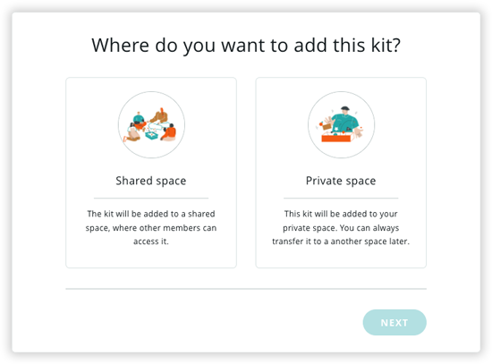

 Most Arduino Education kits don't require registration, and all online learning content can be found by visiting [courses.arduino.cc](https://www.arduino.cc/education/courses/). However, some kits need to be registered to have full access to their respective courses. See [which kits need to be registered](https://support.arduino.cc/hc/en-us/articles/4402999992850-Where-is-the-activation-code-for-my-kit#kits).

 Follow the steps below to register your Arduino Education kit.

## Register a kit

> [!WARNING]
> To share access to the kit, it must be added to a shared space.
>
> If you need to transfer it after it's been added to a space, please [contact us](https://www.arduino.cc/en/contact-us/).

1. Go to [app.arduino.cc/registration](https://app.arduino.cc/registration).

2. Choose whether to add the kit to your private space, or add it to a shared space.

   

3. If you selected "shared space" in the previous step, select a space and click **Next**.

   

4. Enter the activation code and click **Register**.

   

Your kit will be added to the space.

## Troubleshooting

* [Find the activation code for your kit](https://support.arduino.cc/hc/en-us/articles/4402999992850-Where-is-the-activation-code-for-my-kit-).
* [If the kit activation code does not work](https://support.arduino.cc/hc/en-us/articles/360017549580-If-the-kit-activation-code-does-not-work).
