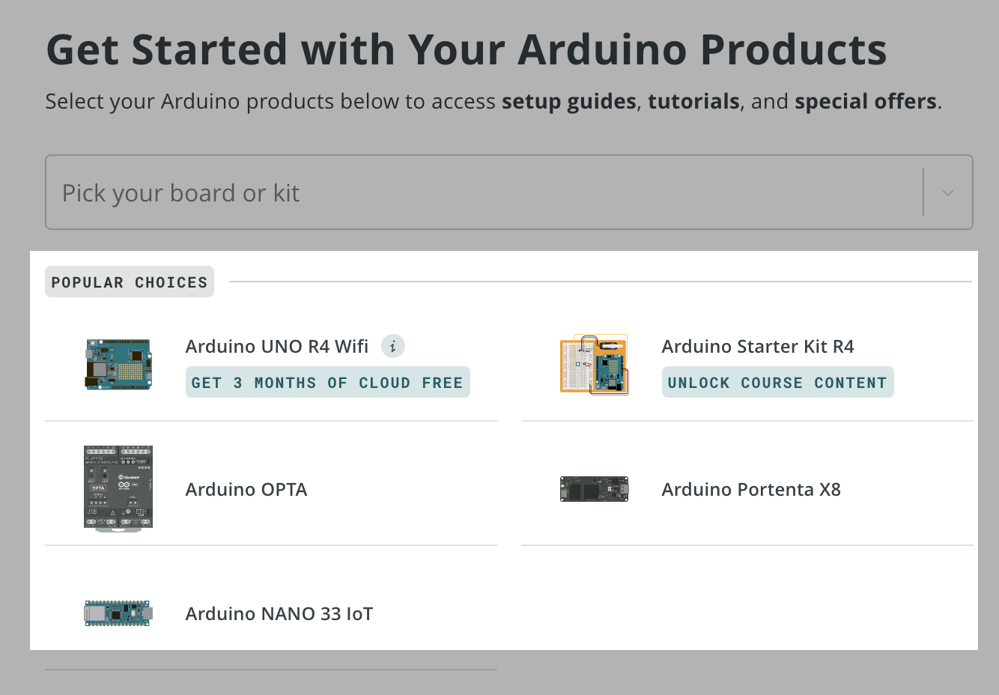

You can register supported products to add them to your personal collection at [id.arduino.cc/boards](https://id.arduino.cc/boards), for easy access to its documentation. For some products, registration also unlocks exclusive features or content.

> [!IMPORTANT]
> Kits released before November 2025 no longer use registration to unlock online courses, but some may include features that are activated in other ways. For more information, see [About activation codes for Arduino products](https://support.arduino.cc/hc/en-us/articles/4402999992850-About-activation-codes-for-Arduino-products).

Avoid using the QR code to open the registration page, as it may not load the page correctly.

In this article:

<!-- TOC -->

- [About product registration](#about-product-registration)
- [Products that support registration](#products-that-support-registration)
- [Register an Arduino Starter Kit R4](#register-an-arduino-starter-kit-r4)
- [Register an Arduino UNO R4 WiFi](#register-an-arduino-uno-r4-wifi)
- [Register other products](#register-other-products)
- [View your registered products](#view-your-registered-products)

<!-- /TOC -->

---

## About product registration

You can register supported products to add them to your personal collection at [id.arduino.cc/boards](https://id.arduino.cc/boards). This gives you easy access to documentation on Arduino Docs. For some products, registration also unlocks exclusive features or content.

| Product                                  | Unlocks paid feature | Added to profile |
|------------------------------------------|----------------------|------------------|
| Arduino Starter Kit R4                   | ✔                    | ✔                |
| Arduino UNO R4 WiFi                      | ✔                    | ✔                |
| Other products that support registration |                      | ✔                |

## Products that support registration

The following products can be registered:

- Alvik
- Due
- Leonardo
- Mega 2560 Rev3
- Micro
- MKR 1000 WiFi
- MKR FOX 1200
- MKR GSM 1400
- MKR NB 1500
- MKR Vidor 4000
- MKR WAN 1300
- MKR WAN 1310
- MKR WiFi 1010
- MKR Zero
- Nano
- Nano 33 BLE
- Nano 33 BLE Rev2
- Nano 33 BLE Sense
- Nano 33 BLE Sense Rev2
- Nano 33 IoT
- Nano ESP32
- Nano Every
- Nano Matter
- Nano R4
- Nano RP2040 Connect
- Nesso N1
- Nicla Sense Env
- Nicla Sense ME
- Nicla Vision
- Nicla Voice
- Portenta C33
- Portenta H7
- Portenta H7 Lite
- Portenta H7 Lite Connected
- Starter Kit R4
- Stella
- UNO Mini Limited Edition
- UNO R3
- UNO R3 SMD
- UNO R4 Minima
- UNO R4 WiFi
- UNO WiFi Rev2
- Yún Rev2
- Zero
{.multi-col-list}

The following products may appear on the registration page, but are currently not supported:

- Portenta X8 <!--- Does not work as of 2026-02-02 -->

---

## Register an Arduino Starter Kit R4

By registering Arduino Starter Kit R4 you can access extra projects and multi-language content.

Follow these steps to register your Starter Kit R4:

1. Go to [arduino.cc/start](https://arduino.cc/start).

2. Find and click on **Arduino Starter Kit R4** on the page.

   > [!NOTE]
   > For this product, do not use the "Pick your board or kit" dropdown menu.

3. You may be prompted to sign up for the Arduino newsletter. Choose **Sign me up** or **Skip**.

4. Find the sticker on the Starter Kit R4 box. Type the product code, labeled "serial", into the **Product code** field.

   > [!TIP]
   > The sticker has a QR code and the text "SCAN THE QR". If you have trouble scanning the QR code on the box, you can follow these steps to register your kit manually.

5. Click **Verify and Activate** to complete the registration.

## Register an Arduino UNO R4 WiFi

Registering your UNO R4 WiFi unlocks a free 3-month trial of the Arduino Cloud Maker plan.

Follow these steps to register your UNO R4 WiFi:

1. Go to [arduino.cc/start](https://arduino.cc/start).

2. Find and click on **Arduino UNO R4 WiFi** on the page.

   > [!NOTE]
   > For this product, do not use the "Pick your board or kit" dropdown menu.

3. You may be prompted to sign up for the Arduino newsletter. Choose **Sign me up** or **Skip**.

4. Find the sticker on the Arduino UNO R4 WiFi box. Type the product code, labeled "serial", into the **Product code** field.

   > [!TIP]
   > The sticker has a QR code and the text "SCAN THE QR".

5. Click **Verify and Activate** to complete the registration.

---

## Register other products

Many other Arduino boards can be registered to your account. This adds the board to your personal collection at [id.arduino.cc/boards](https://id.arduino.cc/boards), for easy access to the documentation. See [Products that support registration](#products-that-support-registration) for a list of supported products.

Follow these steps:

1. Go to [arduino.cc/start](https://arduino.cc/start).

2. Select your product:

   - If your product is listed under Popular Choices, click on it.
   - Otherwise, select your product from the "Pick your board or kit" dropdown menu. Note that products listed as "popular choices" may not appear in this list.

   

3. Follow the on-screen instructions. You may be asked to sign up for the newsletter before proceeding.

4. On the "Register your Arduino Board" page, click **Select your product**.

5. Select your product again in the menu and click **Register Product**. Your board will now appear in your list of registered products.

---

## View your registered products

Once you've registered your products, you can easily view them in your Arduino account.

1. Go to [id.arduino.cc/boards](https://id.arduino.cc/boards).
2. All your registered products will be listed here.
3. Click on any product to open its documentation.
