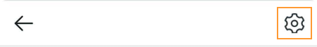
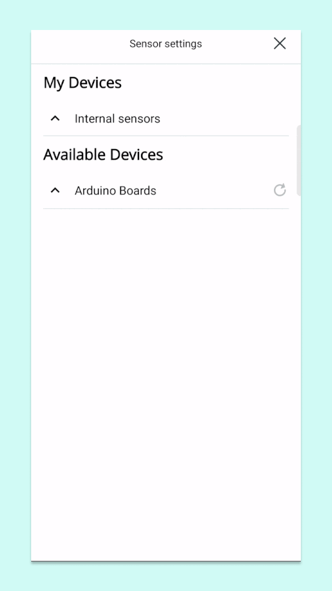
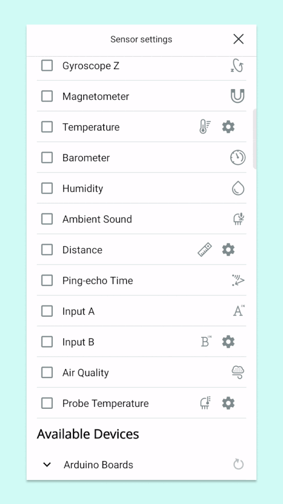

Learn how to connect a board to the Arduino Science Journal app. In this article:

* [Compatible boards](#compatible-boards)
* [Set up your board](#set-up-your-board)
* [Connect the Science Journal app](#connect-the-science-journal-app)
* [Troubleshooting](#troubleshooting)

---

## Compatible boards

The Science Journal can be used with the following boards:

* Arduino MKR WiFi 1010 (with the Science Carrier, or Science Carrier Rev2)
* Arduino Nano 33 BLE Sense
* Arduino Nano 33 BLE Sense Rev2
* Arduino Nano RP2040 Connect (by itself, or with the Science Carrier R3)

> Note: The MKR WiFi 1010 needs to be connected using the Science Carrier, which is only available in the [Arduino Science Kit Physics Lab](https://store.arduino.cc/products/arduino-science-kit-physics-lab).

## Set up your board

1. **Upload the Science Journal firmware:**

   * If your board came with a Science Kit, **it will have the the required firmware out-of-the-box**.
   * If you're using a board not included in a Science Kit, an individually bought board replacement, or have flashed the board with different firmware, see [Upload the Science Journal firmware](https://support.arduino.cc/hc/en-us/articles/4408029337746-Upload-the-Science-Journal-firmware).

2. **If you're using a Science Carrier:** Connect the board to the Science Carrier, ensuring that the pins (e.g., A1, A2) align properly.

3. Power the setup, via a USB cable to the board or otherwise.

## Connect the Science Journal app

1. Open the Science Journal app.

2. Open or create a new experiment.

3. Tap the **Edit** button in the bottom-right.

4. Tap **Sensors**.

   

5. Open settings by tapping the cogwheel button in the top right.

   

6. Scroll down to **Available devices** and find the "Arduino Boards" category. Tap to to expand it (you may have to scroll down for the revealed items to show).

7. Tap your device name to connect.

## Troubleshooting

### Make sure you're expanding the Arduino Boards category

Under **Available Devices**, the arrow next to Arduino Boards should be pointing downwards (if not, tap it). You may have to swipe down to see the list.

### The board may already be added

If both the Internal sensors and the board sensor categories are expanded, they can be mistaken for a single category. Try swiping up, and tap to collapse the Internal sensors category. Your board may appear below.

