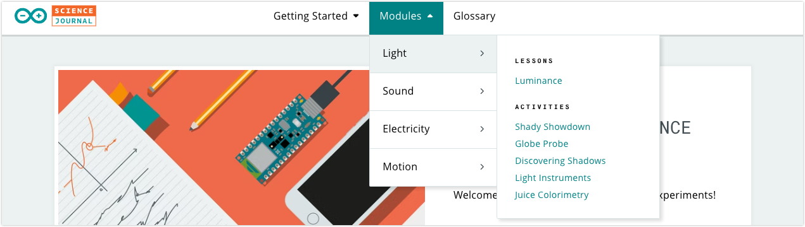

Learn how to get started with the Arduino Science Journal. In this article:

* [Get the app](#get-the-app)
* [Compatible boards](#compatible-boards)
* [Access lessons and activities](#access-lessons-and-activities)
* [Troubleshooting](#troubleshooting)

---

## Get the app

You can download the Arduino Science Journal app from the App Store (iOS) and Google Play (Android).

* [Download on the App Store](https://apps.apple.com/us/app/arduino-science-journal/id1518014927)
* [Get it on Google Play](https://play.google.com/store/apps/details?id=cc.arduino.sciencejournal)

Read [Setting up Experiments](https://science-journal.arduino.cc/sj/module/getting-started-1/lesson/setting-up-experiments) for instructions on how to setup the app on an Android or iOS device.

## Compatible boards

The Science Journal can be used with the following boards:

* Arduino MKR WiFi 1010 (with the Science Carrier, or Science Carrier Rev2)
* Arduino Nano 33 BLE Sense
* Arduino Nano 33 BLE Sense Rev2
* Arduino Nano RP2040 Connect (by itself, or with the Science Carrier R3)

> Note 1: The MKR WiFi 1010 needs to be connected using the Science Carrier, which is only available in the [Arduino Science Kit Physics Lab](https://store.arduino.cc/products/arduino-science-kit-physics-lab).
>
> Note 2: If your board came with a Science Kit, it will have the the required firmware out-of-the-box. If you are using an individually bought board replacement or have flashed the board with different firmware, see [Upload the Science Journal firmware](https://support.arduino.cc/hc/en-us/articles/4408029337746-Upload-the-Science-Journal-firmware).

## Connect a board

You can find [instructions on how to connect a board here](https://support.arduino.cc/hc/en-us/articles/4407749620370-Connect-a-board-to-the-Science-Journal-app).

## Access lessons and activities

Lessons and activities are available within the different modules:

1. Go to <https://science-journal.arduino.cc>

2. Hover over the **Modules** menu option.

3. Hover over one of the modules.

4. Click one of the lessons or activities.

## Troubleshooting

* If you're using a Science Carrier, make sure the board is properly connected to it and that the pins (e.g. A1, A2) line up.
* Make sure your board has the correct firmware. See [Upload the Science Journal firmware](https://support.arduino.cc/hc/en-us/articles/4408029337746-Upload-the-Science-Journal-firmware) for more information.
* [If Arduino Science Journal quits unexpectedly or does not start](https://support.arduino.cc/hc/en-us/articles/4409561973010)
