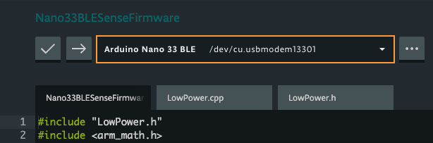
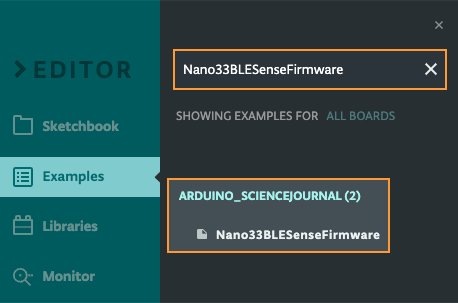
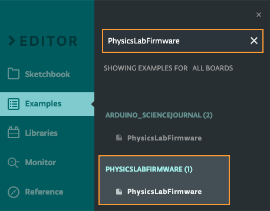
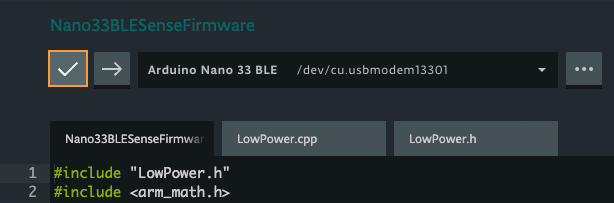
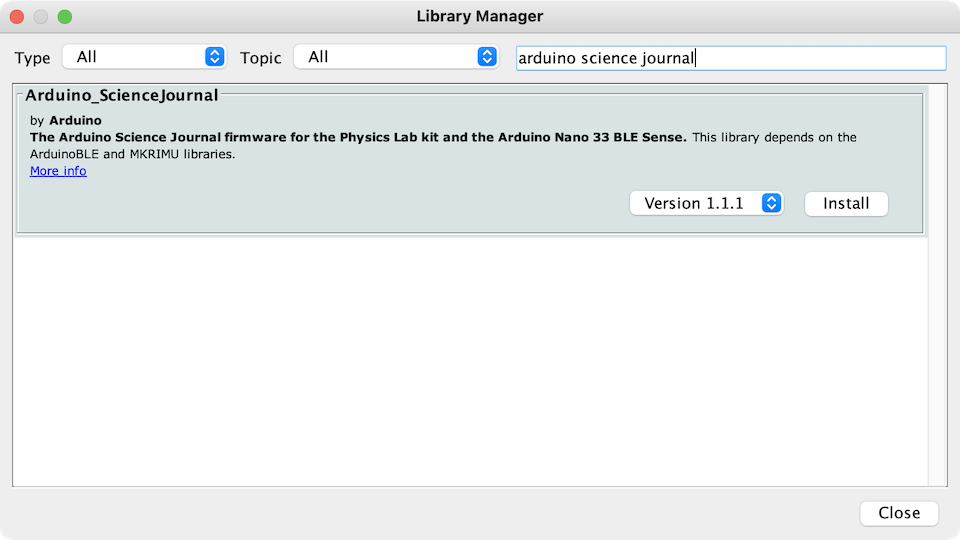

Boards supported by the Science Journal App require special firmware to connect.

- Arduino Nano 33 BLE Sense
- Arduino MKR WiFi 1010

---

## Using the Web Editor

1. Open the [Web Editor](https://create.arduino.cc/editor).

2. Connect your board to your computer with a USB cable.

3. Select your board in the board dropdown.

   

4. Click on **Examples** in the left-most sidebar to open the Examples tab.

   - If you're using Nano 33 BLE Sense, search for "Nano33BLESenseFirmware" and open the  the result in the ARDUINO_SCIENCEJOURNAL library.

     

   - MKR WiFi 1010: Search for `PhysicsLabFirmware` and open the result from the PHYSICSLABFIRMWARE library, **not** the ARDUINO_SCIENCEJOURNAL library.

      

5. Click the  **Upload** button.

   

6. Wait for the process to finish.

> Compilation for the Nano 33 BLE Sense may take several minutes, and the console will not print any messages during this time.

When the upload is completed you can [connect your board to the Science Journal app](https://support.arduino.cc/hc/en-us/articles/4407749620370).

---

## Using Arduino IDE

### Install the libraries

You need to install the following libraries:

- `Arduino_ScienceJournal`
- `Adafruit LSM9DS1 Library` (MKR WiFi 1010 only)

Find and install the libraries by using the Library Manager (`Tools > Manage Libraries...`).

### Run the firmware upload sketch

1. Find and open the firmware upload sketch:

   - **MKR WiFi 1010:**

     IDE 1.x: `File > Examples > INCOMPATIBLE > Arduino_ScienceJournal > PhysicsLabFirmware`.

     IDE 2.x: `File > Examples > Arduino_ScienceJournal > PhysicsLabFirmware`.

   - **Nano 33 BLE Sense:**

     IDE 1.x: `File > Examples > INCOMPATIBLE > Arduino_ScienceJournal > Nano33BLESenseFirmware`, depending on the IDE version.

     IDE 2.x: `File > Examples > Arduino_ScienceJournal > Nano33BLESenseFirmware`

2. Click the  **Upload** button.

3. Wait for the process to finish.

> Compilation for the Nano 33 BLE Sense may take several minutes, and the console will not print any messages during this time. In IDE 1.8, you can monitor the progress bar in the console's top-right corner.

When the upload is completed you can [connect your board to the Science Journal app](https://arduino.zendesk.com/knowledge/articles/4407749620370).

### Troubleshooting

#### If you can't find the library

- Make sure the library is installed in the Library Manager
- Make sure your board is selected in `Tools > Board`.

#### Adafruit_LSM9DS1.h: No such file or directory

If you get this error message, you need to install the `Adafruit LSM9DS1 Library` and it's dependencies in the Library Manager.
