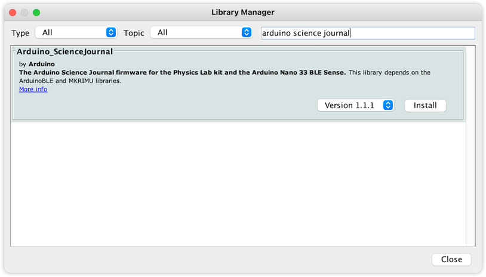

Boards supported by the Science Journal App require special firmware to connect.

- Arduino Nano 33 BLE Sense
- Arduino MKR WiFi 1010

## Install the libraries

You need to install the following libraries:

- `Arduino_ScienceJournal`
- `Adafruit LSM9DS1 Library` (MKR WiFi 1010 only)

Find and install the libraries by using the Library Manager (`Tools > Manage Libraries...`).



## Run the firmware upload sketch

1. Find and open the firmware upload sketch:

   - **MKR WiFi 1010:** `File > Examples > Arduino Science Journal > PhysicsLabFirmware`.

   - **Nano 33 BLE Sense:** `File > Examples > Arduino Science Journal > Nano33BLESenseFirmware` or `File > Examples > INCOMPATIBLE > Arduino Science Journal`, depending on the IDE version.

2. Click the  **Upload** button.

3. Wait for the process to finish.

> Compilation for the Nano 33 BLE Sense may take several minutes, and the console will not print any messages during this time. In IDE 1.8, you can monitor the progress bar in the console's top-right corner.

When the process is completed you will be able to [connect your board to the Science Journal app](https://arduino.zendesk.com/knowledge/articles/4407749620370).

## Troubleshooting

### If you can't find the library

- Make sure the library is installed in the Library Manager
- Make sure your board is selected in `Tools > Board`.

### Adafruit_LSM9DS1.h: No such file or directory

```
PhysicsLabFirmware:21:10: fatal error: Adafruit_LSM9DS1.h: No such file or directory
 #include <Adafruit_LSM9DS1.h> // click here to install the library: http://librarymanager#Adafruit&LSM9DS1
          ^~~~~~~~~~~~~~~~~~~~
compilation terminated.
exit status 1
Adafruit_LSM9DS1.h: No such file or directory
```

If you get this error message, you need to install the `Adafruit LSM9DS1 Library` in the Library Manager.
