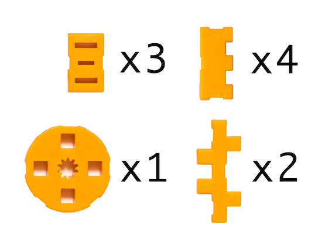
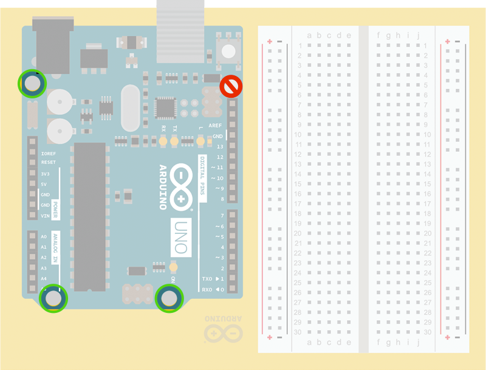

## Projects book instructions

Instructions for the project board can be found in the projects book, pages 12-13:

1. Take the plastic sheet and carefully separate the pieces.
2. Go on until you've separated all the parts.
3. Place the pieces marked with an "A" into the holes in the corners, in order to create the feet of the base.
4. Secure your Arduino Uno to the base using 3 screws (included in the silver pack in this kit). Be careful not to overtighten.
5. Carefully peel the backing from the breadboard.
6. Stick the breadboard on the plastic sheet, next to the Arduino Uno.

> Early prints of the projects book have an image where the base is mirrored. The instructions above are correct.

You can also check this video demonstration:

<video width="800" height="450" controls>
  <source src="https://www.datocms-assets.com/42182/1615389080-student-kit-mounting-the-project-board-4.mp4" type="video/mp4">
  Your browser does not support the video tag.
</video>

## Additional instructions

This section contains additional detail for some steps.

### Separating the plastic pieces

* Carefully twist and press on the pieces to separate them from the sheet.
* You may need to trim off the plastic that is remaining where the pieces connect to the sheet.
* When you're finished you should have the following pieces:

### Aligning the components

1. Align the Arduino UNO so that the reset button faces away from the Arduino logo on the project board.
2. Align the breadboard so that `a1` is next to the reset button on the UNO.

Then, insert the three bolts in the holes marked below. No bolt is inserted in the hole above the reset button.

### Mount the board

* Make sure the screw holes on the UNO are aligned with the three holes on the project board.
* Do not insert a screw in the hole next to the reset button.

