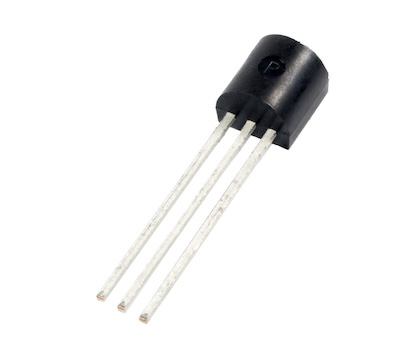

A temperature sensor will change its voltage output depending on the temperature of the
component. Learn how to find the sensor in your kit.

---

The temperature sensor included in the Starter Kit looks like this:

Here are some tips to help tell it apart from other components:

* All three pins on the temperature sensor are straight, unlike the included transistors, which have a bend in the two outer pins.
* Look for the label "TMP" or "MCP9700AE" on the flat side of the temperature sensor. You may need a flashlight to see the text clearly.