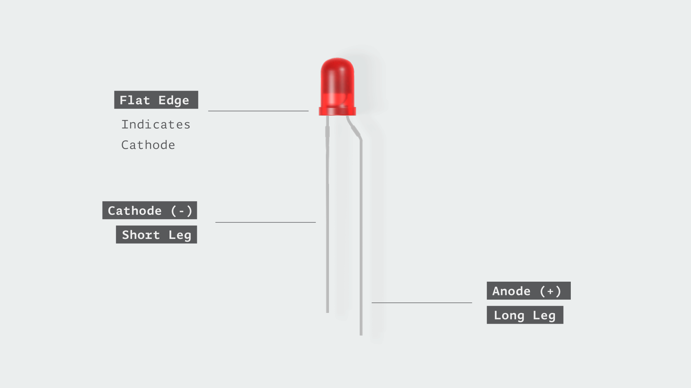

LEDs can be represented graphically in different ways depending on which circuit simulation software is used.

The LEDs in your kit have two terminal, one short and one long. The long wire is called the anode, and the short wire is called the cathode. On some LEDs, the cathode side of the LED has a flat edge. Current must enter the LED through the anode and exit through the cathode.

Therefore, the anode (**Long Leg**) should be toward the positive terminal of the breadboard, and the cathode (**Short Leg**) should be toward to ground (negative terminal).
