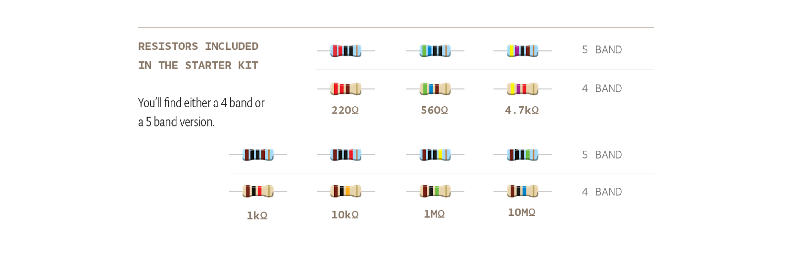
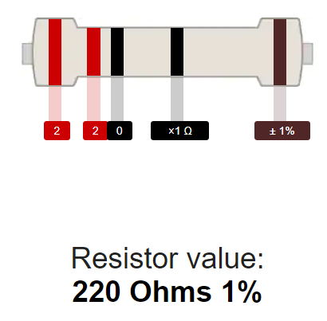
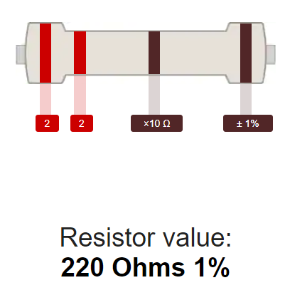

As mentioned in the Documentation, resistors can be coded in 4 or 5 bands.

The 220 ohms resistors included inside the electronic component box can be coded either in 4 bands or 5, please check carefully in the resistor array.

The 5 bands 220 Ohm resistor will have bands like these:

While a 4 band 220 Ohm resistor will look as follows:

