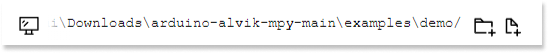
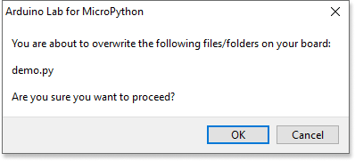

If you need to restore the default examples on your Alvik device, follow the steps to download the necessary files and overwrite the existing ones. This process will reset your Alvik device to its original configuration, ensuring you have the default example files in place.

## Download default examples

1. Visit the [Arduino Alvik MicroPython GitHub repository](https://github.com/arduino/arduino-alvik-mpy).

1. Click the 'Code' button.

1. Select 'Download ZIP' from the dropdown menu.

1. Once the download is complete, extract the contents of the ZIP file.

## Restore default examples

1. Open Arduino Lab for MicroPython and click the  file manager button

1. Navigate to the folder you just extracted, then open the 'examples' folder and go to the 'demo' subfolder.

   

1. Connect your Alvik device to your computer and select it. The folders on the device will now become visible

1. Select one of the files from the extracted folder, then click the  arrow button to upload it.

1. A dialog window will appear, notifying you that you are about to overwrite the file. Click 'OK' to confirm.

   

1. Repeat this process for the remaining files in the extracted folder.

1. Once all files have been overwritten, the default examples on your Alvik device will be reset.
