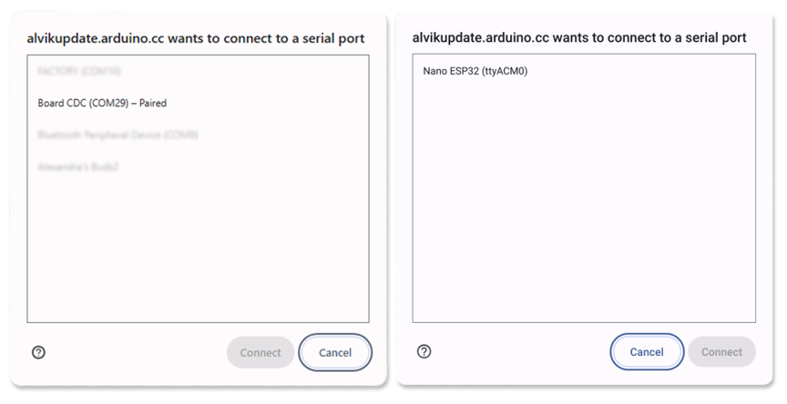
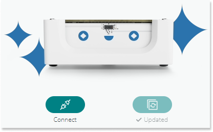

Keeping your Alvik’s firmware updated ensures it has the latest features, bug fixes, and performance improvements. Learn how to update your Arduino Alvik with the Alvik Updater.

In this article:

- [About Alvik Updater](#about-alvik-updater)
- [How to update your Alvik](#how-to-update-your-alvik)
- [Troubleshooting](#troubleshooting)

## About Alvik Updater

**The Alvik Updater will:**

- Update or install the Alvik MicroPython library
- Update or install the Alvik Carrier firmware

The Alvik Updater will not restore default demo examples, remove any projects or files added by the user, or update/install the MicroPython firmware on the Nano ESP32 board. For instructions on updating or installing the MicroPython firmware, refer to [the MicroPython firmware installation guide](https://support.arduino.cc/hc/en-us/articles/15156644171548-Upload-firmware-for-Arduino-Lab-for-Micropython).

## How to update your Alvik

1. Go to the [Arduino Alvik Updater](https://alvikupdate.arduino.cc/)

1. Turn on your Alvik robot and connect the Nano ESP32 to your Computer with a USB-C cable.

1. Click on the 'Connect' button.

1. A dialog window will open, prompting you to select a device.

   

   You can disconnect and reconnect the device to verify the correct port in the serial port dialog.

   > [!NOTE]
   > The appearance of this window may vary depending on your operating system. Similarly, the port you need to select might differ in name or format.

1. Once the device is connected, the 'Update' button will become clickable. Click the 'Update' button to proceed.

1. Wait for the update to finish. This process may take some time.

   

   The update is complete when a checkmark and the text "Updated" appear below the update button.

## Troubleshooting

### If the update seems to have stopped

If the update button seems unresponsive or does not continue loading:

1. Ensure the switch on the Alvik is set to "On."

1. Reload the page and try the update again.

### If your Alvik doesn’t appear in the dialog window

1. **Verify the board port in Arduino Lab for MicroPython**

   Alvik is often not displayed as "Alvik" in the dialog window. It may sometimes appear as "Nano ESP32" or under another name, with the port listed in parentheses e.g., (COM29) on Windows or (ttyACM0) on Chromebook. If there are multiple options, you can confirm which port corresponds to your Alvik by connecting it to Arduino Lab for MicroPython. Alternatively, you can disconnect and reconnect the device to quickly verify the correct port in the serial port dialog.

1. **Reconnect Alvik**

   - Disconnect and reconnect your alvik to reset its power.
   - Look for any system notifications requesting USB device permissions and grant them if prompted.

1. **Check the board connection**

   - Ensure you’re using a data USB cable, not a charging-only cable.
   - Connect the Alvik directly to your computer, bypassing any USB hubs.
   - If the Alvik still isn’t detected, try a different USB port.
