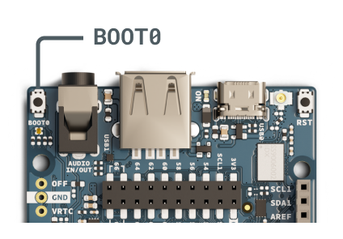
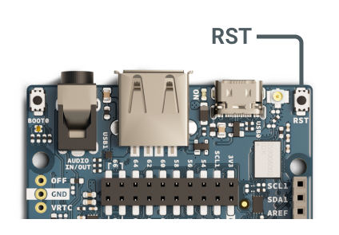
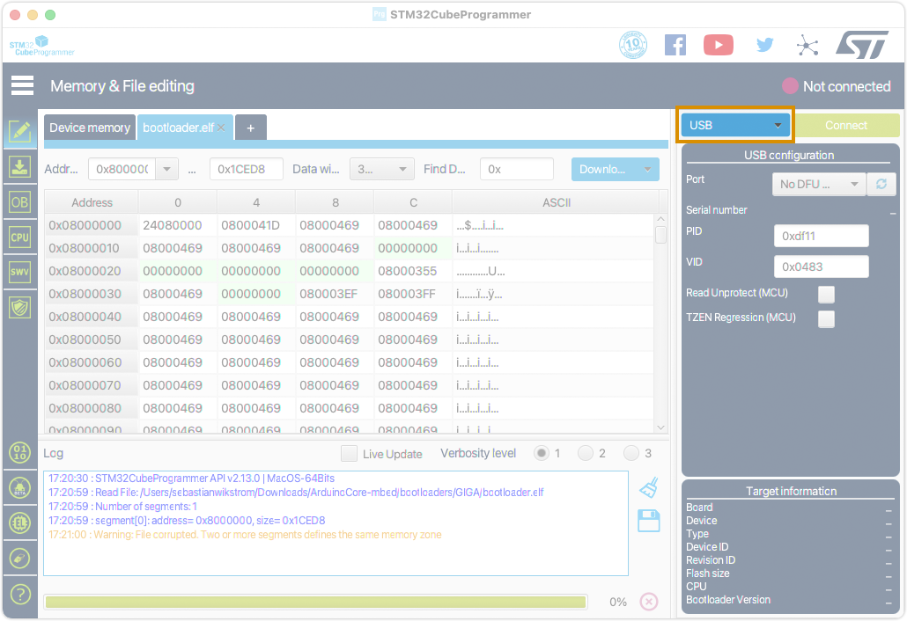
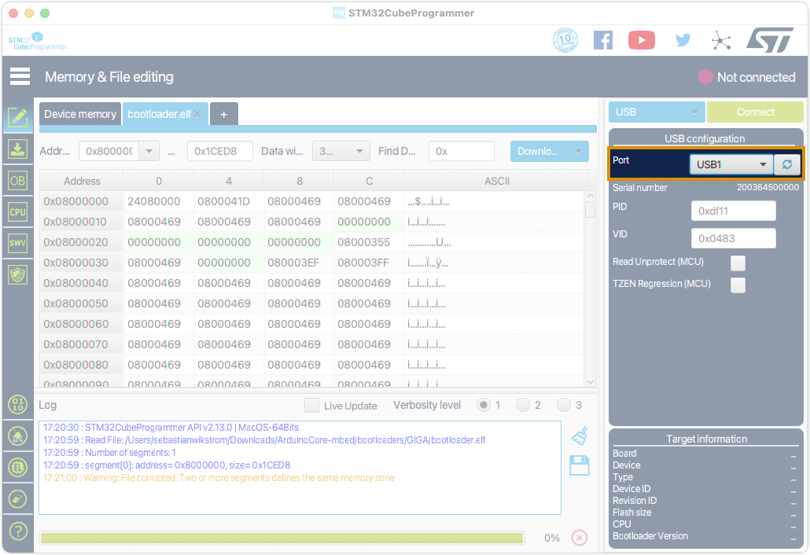
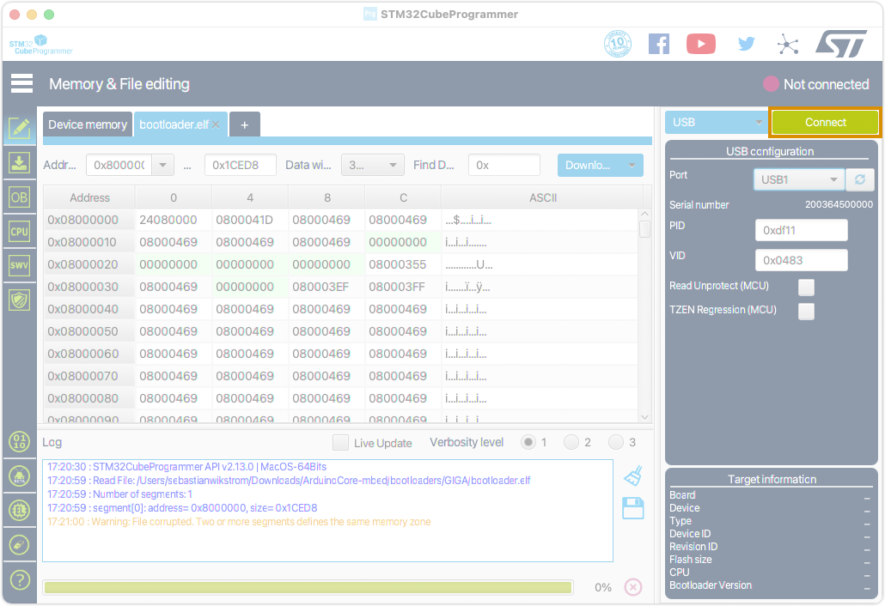
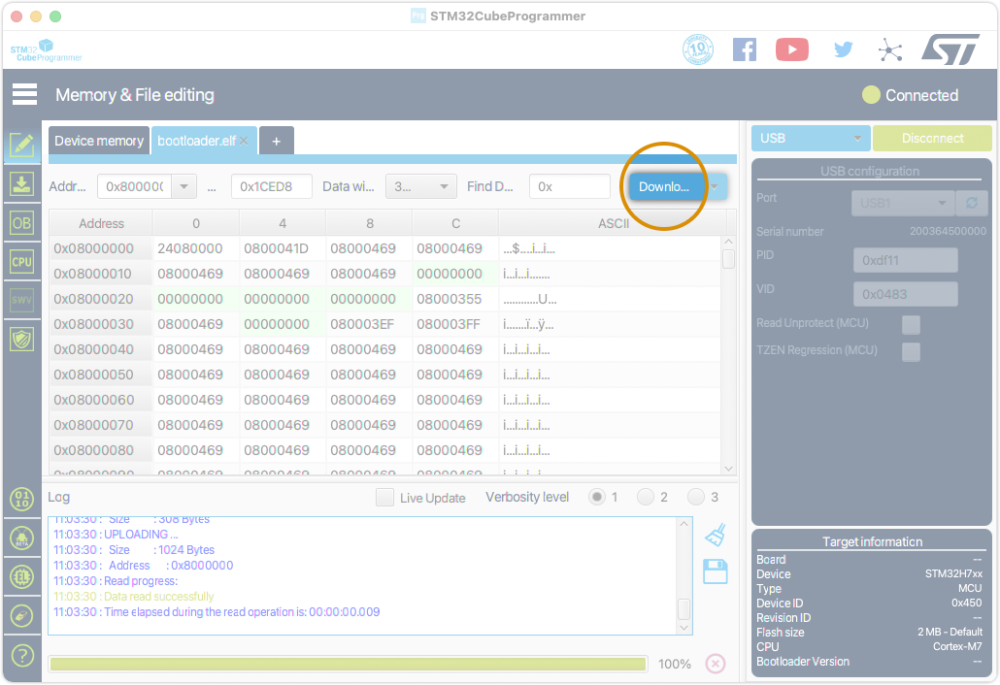

Learn how to burn (flash) the bootloader on GIGA R1 WiFi.

In this article:

* [Prepare your GIGA R1 WiFi for bootloader flashing](#prepare)
* [Flash the bootloader with dfu-util (recommended)](#dfu-util)
* [Flash the bootloader with STM32CubeProgrammer](#stm32cubeprogrammer)

---

<a id="prepare"></a>

## Prepare your GIGA R1 WiFi for bootloader flashing

To burn the bootloader on GIGA R1 WiFi, it needs to be connected in DFU mode:

1. Connect your GIGA R1 WiFi to your computer using a USB cable.

1. Find the two push buttons labeled **BOOT0** and **RST** on the board:

1. Press and hold **BOOT0** button.

   

1. Keep the **BOOT0** button pressed down, and press the **RST** button once.

   

1. Release both buttons. GIGA R1 WiFi will briefly disconnect and reconnect to your computer.

---

<a id="dfu-util"></a>

## Flash the bootloader with dfu-util (recommended)

If you've installed the **Arduino Mbed OS Giga Boards** package on your computer using the [Boards Manager in Arduino IDE](https://support.arduino.cc/hc/en-us/articles/360016119519-Add-boards-to-Arduino-IDE) or Arduino CLI, you can used the included **dfu-util** tool to flash the bootloader on your GIGA R1 WiFi board.

### Windows

1. [Prepare your GIGA R1 WiFI for bootloader flashing](#prepare).

1. Open **Command Prompt** by right-clicking in the bottom-left corner of the screen and selecting Command Prompt, or by searching for "cmd" in the taskbar.

1. Copy this command:

   `"%LOCALAPPDATA%\Arduino15\packages\arduino\tools\dfu-util\0.11.0-arduino5\dfu-util" --device ,0x0483:0xdf11 -D "%LOCALAPPDATA%\Arduino15\packages\arduino\hardware\mbed_giga\4.0.6\bootloaders\GIGA\bootloader.bin"  -a0 --dfuse-address=0x8000000`

1. If neccessary, modify the package version number (4.0.6) to whichever is installed.

1. Right-click inside the Command Prompt window to paste the command, then press <kbd>Enter</kbd> to begin flashing the bootloader.

> **Note:** To use Powershell instead of Command Prompt, copy this command instead:
>
> `&"$Env:LOCALAPPDATA\Arduino15\packages\arduino\tools\dfu-util\0.11.0-arduino5\dfu-util" --device ,0x0483:0xdf11 -D "$Env:LOCALAPPDATA\Arduino15\packages\arduino\hardware\mbed_giga\4.0.6\bootloaders\GIGA\bootloader.bin"  -a0 --dfuse-address=0x8000000`

### macOS

1. [Prepare your GIGA R1 WiFI for bootloader flashing](#prepare).

1. Open **Terminal**. You can find it with Spotlight by pressing <kbd>⌘</kbd> + <kbd>Space</kbd> and typing "Terminal".

1. Copy this command:

   `~/Library/Arduino15/packages/arduino/tools/dfu-util/0.11.0-arduino5/dfu-util --device ,0x0483:0xdf11 -D ~/Library/Arduino15/packages/arduino/hardware/mbed_giga/4.0.6/bootloaders/GIGA/bootloader.bin  -a0 --dfuse-address=0x8000000`

1. If neccessary, modify the package version number (4.0.6) to whichever is installed.

1. Select the Terminal window and press <kbd>⌘</kbd> + <kbd>V</kbd> to paste the command, then press <kbd>Enter</kbd> to begin flashing the bootloader.

### Linux

1. [Prepare your GIGA R1 WiFI for bootloader flashing](#prepare).

1. Open your computer's command line application (often referred to as shell, terminal, console, prompt or various other names). Look for it in your launcher, or try the <kbd>Ctrl</kbd> + <kbd>Alt</kbd> + <kbd>T</kbd> keyboard shortcut (available on most Linux systems).

1. Copy this command:

   `~/.arduino15/packages/arduino/tools/dfu-util/0.11.0-arduino5/dfu-util --device ,0x0483:0xdf11 -D ~/.arduino15/packages/arduino/hardware/mbed_giga/4.0.6/bootloaders/GIGA/bootloader.bin  -a0 --dfuse-address=0x8000000`

1. If neccessary, modify the package version number (4.0.6) to whichever is installed.

1. Select the Terminal window and press <kbd>Ctrl</kbd> + <kbd>⇧Shift</kbd> + <kbd>V</kbd> to paste the command, then press <kbd>Enter</kbd> to begin flashing the bootloader.

---

<a id="stm32cubeprogrammer"></a>

## Flash the bootloader with STM32CubeProgrammer

If you prefer to use a graphical interface, you can use <a class="link-external" href="https://www.st.com/en/development-tools/stm32cubeprog.html">STM32CubeProgrammer</a>.

> **Note:** To use STM32CubeProgrammer on macOS, you may need to run the executable directly: Right-click the `.app` container and select **Show package contents**, then navigate into `Contents/MacOs`. Double-click the file `SetupSTM32CubeProgrammer-X_Y_Z_macos` executable.

1. [Prepare your GIGA R1 WiFI for bootloader flashing](#prepare).

1. Open STM32CubeProgrammer and click on **Open file**.

   

1. Select the bootloader from one of the following locations:

   * <a class="link-download" href="https://github.com/arduino/ArduinoCore-mbed/raw/main/bootloaders/GIGA/bootloader.elf">Download the bootloader file</a> and select it from your default download location.

   * If you've installed the Arduino Mbed OS Giga Boards package, you can also find it inside your [Arduino15 folder](https://support.arduino.cc/hc/en-us/articles/360018448279-Open-the-Arduino15-folder).

     * **Windows:** `C:\Users\{username}\AppData\Local\Arduino15\packages/arduino/hardware/mbed_giga/4.0.6/bootloaders/GIGA/bootloader.elf`

     * **macOS:** `~/Library/Arduino15/packages/arduino/hardware/mbed_giga/4.0.6/bootloaders/GIGA/bootloader.elf`

     * **Linux:** `~/.arduino15/Arduino15/packages/arduino/hardware/mbed_giga/4.0.6/bootloaders/GIGA/bootloader.elf`

1. If you get a "Warning: File corrupted. Two or more segments defines the same memory zone" message, ignore it.

1. Set the programmer selection (default: ST-LINK) to **USB**.

   

1. For the **Port** selection, select your board. To refresh the list, click the update button.

   

1. Click on **Connect** button. The connection status should change from "Not connected" to "Connected".

   

1. Click on the **Download** button. If you get another warning message, close it by selecting OK.

   > **Note:** Click on the left part of the button where it says "Download" (not the arrow, which opens a context menu)

   

1. The message "File download complete" will appear as a pop-up notification when the download is complete.

1. Disconnect and reconnect GIGA R1 WiFi to your computer.

---

## Troubleshooting

### `dfu-util: No DFU capable USB device available`

Make sure the Giga R1 is reset while holding the **BOOT0** button.

### `LIBUSB_ERROR_NOT_SUPPORTED`

```
Cannot open DFU device 0483:df11 found on devnum 2 (LIBUSB_ERROR_NOT_SUPPORTED)
No DFU capable USB device available
```

### Check drivers (Windows only)

1. Connect GIGA R1 WiFi in DFU mode.
1. Open Device Manager and locate the DFU in FS Mode (should have a yellow triangle).
1. Select and hold (or right-click) the device and select Update driver… / Update driver 1. software...  from the context menu.
1. In the wizard, select Browse my computer for driver software.
1. Select Let me pick from a list of device drivers on my computer.
1. From the list of device classes, select Universal Serial Bus devices. If you don’t see 1. it, untick Show compatible hardware.
1. Select WinUsb Device > WinUsb Device.
1. Click Next.
1. Ignore the warning and confirm installing the driver.
