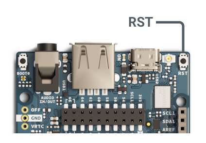

Prepare your GIGA R1 WiFi board for [Over-The-Air (OTA) uploads](https://docs.arduino.cc/arduino-cloud/features/ota-getting-started/).

---

## 1. Connect your GIGA R1 WiFi board to Arduino IDE

> **Note:** The required sketch examples are currently not available in the Web Editor.

1. Open Arduino IDE

1. Connect your GIGA R1 WiFi to your computer with a USB-C cable.

1. Open the board selector and **Arduino Giga R1** or use the Tools > Port and Tools > Board menus.

---

## 2. Format the flash memory

First, you need to format the board's Quad Serial Peripheral Interface (QSPI) flash memory.

**Follow these steps:**

1. Connect your GIGA R1 WiFi to your computer using a USB-C cable.

1. Select your GIGA R1 WiFi in the board selector, or use the _Tools > Port_ and _Tools > Board_ menus.

1. In the top menu bar, open **File > Examples** list. Under the _Examples for Arduino Giga R1_ group, select **STM32H747_System > QSPIFormat**.

1. Click  **Upload** and wait for the sketch upload to complete.

---

## 3. Flash the Wi-Fi firmware

Update the WiFi Firmware Certificates of the board using the code found here: WiFiFirmwareUpdater (make sure you include the three documents in the same folder before uploading the .ino sketch to the board) You can find this sketch and the previous one on your Arduino IDE going: File > Examples > Examples For Arduino Giga R1 > STM32H747_System > WiFiFirmwareUpdater.

1. In the top menu bar, open **File > Examples > STM32H747_System > WiFiFirmwareUpdater**.

1. Click  **Upload** to upload the sketch.

1. Open the Serial Monitor using one of these methods:

   * Click the  button in the top-right corner.

   * Select _Tools > Serial Monitor_ in the menu bar.

1. If the Serial Monitor is empty, run the sketch again by pressing the **RST** button on the board.

   

1. If you get this message:

   `A WiFi firmware is already installed. Do you want to install the firmware anyway? Y/[n]`

   If you do, type `Y` into the text field and press <kbd>Enter</kbd> to send.

1. Wait until `Firmware and certificates updated!` appears in the Serial Monitor output.
