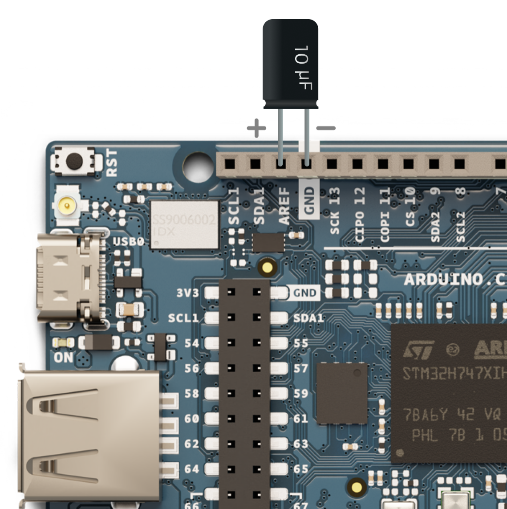

When running a sketch on your GIGA R1 WiFi board that accesses data from a USB drive, you may experience noise in the digital-to-analog converter (DAC) output. It can be particularly noticeable when outputting audio, where a slight hum may be discernible.

---

## Reducing audible noise by adding a capacitor

Audible noise can be reduced by connecting a 10 µF capacitor between the AREF and GND pins.

Follow these steps:

1. Turn off the board.
1. Make sure when adding components or changing your circuits the board is unpowered.
1. Connect the positive capacitor lead (longer) to **AREF**.
1. Connect the negative capacitor lead (shorter) to **GND**.

   

The noise should no longer be noticeable. If it persists, try using a 100uF capacitor instead.

> [!TIP]
> Test it out using the [Audio playback example](https://docs.arduino.cc/tutorials/giga-r1-wifi/giga-audio/#audio-playback).
