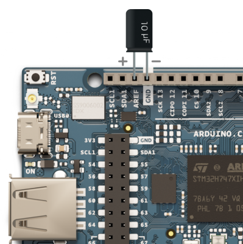

When running a sketch on your GIGA R1 WiFi board that accesses data from a USB drive, you may notice some noise, especially on the Digital-to-Analog Converter (DAC). This is particularly noticeable when using the board's audio output, where a slight hum might be discernible.

---

Add a capacitor between the AREF and GND Pins. Make sure when adding components or changing your circuits the board is unpowered.

## Testing it out

1. Upload the [Audio playback](https://docs.arduino.cc/tutorials/giga-r1-wifi/giga-audio/#audio-playback) sketch.

2. Listen for any noise.

3. Turn off the board.

4. Add the capacitor as shown in the image.

5. Turn the board back on.

The noise should no longer be noticeable. If it persists, check the capacitor's polarity and the integrity of the audio cable.
