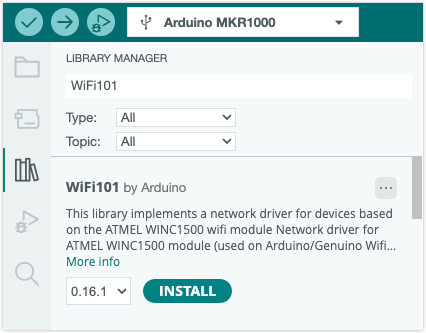

Learn how to check the firmware version for boards and shields with a ATWINC1500 Wi-Fi module.

Boards and shields that use the WiFi101 library:

* Arduino MKR 1000 WiFi
* Arduino WiFi Shield 101

---

## Instructions

We can check the current firmware version by uploading a sketch to the board that will report the version via the serial monitor in Arduino IDE:

1. If you haven't already done so, you need to install the associated library.

   Click the  **Library Manager** button (or select Tools > Manage Libraries), and search for "WiFi101":

   

1. Open File > Examples > WiFi101 > CheckWifi101FirmwareVersion

1. Connect the board to your computer, and select it with the board selector (or the **Tools > Port** menu).

1. Click  **Upload** to upload the sketch to the board.

1. Click the  **Serial Monitor** button in the top-right corner (or select Tools > Serial Monitor).

1. Observe the output:

   

---

## Interpeting the output

If the latest firmware is installed the output will include this line:

```
Check result: PASSED
```

But if a newer firmware version is available the output may look something like this:

```
WiFiNINA firmware check.

Firmware version installed: 1.4.7
Latest firmware version available : 1.4.8

Check result: NOT PASSED
 - The firmware version on the module does not match the
   version required by the library, you may experience
   issues or failures.
```

To update the firmware, see [Update the firmware for WiFiNINA and WiFi101](https://support.arduino.cc/hc/en-us/articles/360013896579-Update-the-firmware-for-WiFiNINA-and-WiFi101).
