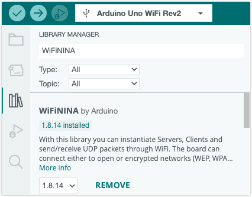
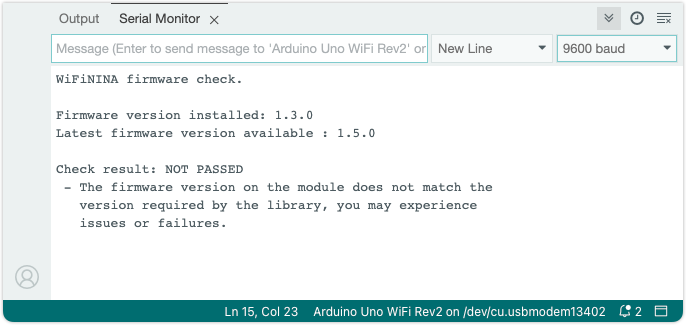

Learn how to check the wireless firmware version for boards using the WiFiNINA library (NINA Wi-Fi modules).

Boards that use the WiFiNINA library:

* Arduino MKR Vidor 4000
* Arduino MKR WiFi 1010
* Arduino Nano 33 IoT
* Arduino Nano RP2040 Connect
* Arduino UNO WiFi Rev2

---

## Upload the CheckFirmwareVersion sketch

We can check the current firmware version by uploading a sketch to the board that will report the version via the serial monitor.

1. If you haven't already done so, you need to install the associated library.

   Click the  **Library Manager** button (or select Tools > Manage Libraries), and search for "WiFiNINA":

   

1. Open File > Examples > WiFiNINA > Tools > CheckFirmwareVersion

1. Connect the board to your computer, and select it with the board selector (or the **Tools > Port** menu).

1. Click  **Upload** to upload the sketch to the board.

1. Click the  **Serial Monitor** button in the top-right corner (or select Tools > Serial Monitor).

1. Observe the output:

   

---

## Interpreting the output

If the latest firmware is installed the output will include this line:

```
Check result: PASSED
```

But if a newer firmware version is available the output may look something like this:

```
WiFiNINA firmware check.

Firmware version installed: 1.4.7
Latest firmware version available : 1.4.8

Check result: NOT PASSED
 - The firmware version on the module does not match the
   version required by the library, you may experience
   issues or failures.
```

---

## Update the firmware

Most boards can be updated both by Arduino IDE and in Arduino Cloud:

* [Use the Firmware Updater in Arduino IDE](https://support.arduino.cc/hc/en-us/articles/360013896579-Use-the-Firmware-Updater-in-Arduino-IDE)
* [Update connectivity module firmware with Arduino Cloud](https://support.arduino.cc/hc/en-us/articles/10501616961564-Update-connectivity-module-firmware-with-IoT-Cloud)
