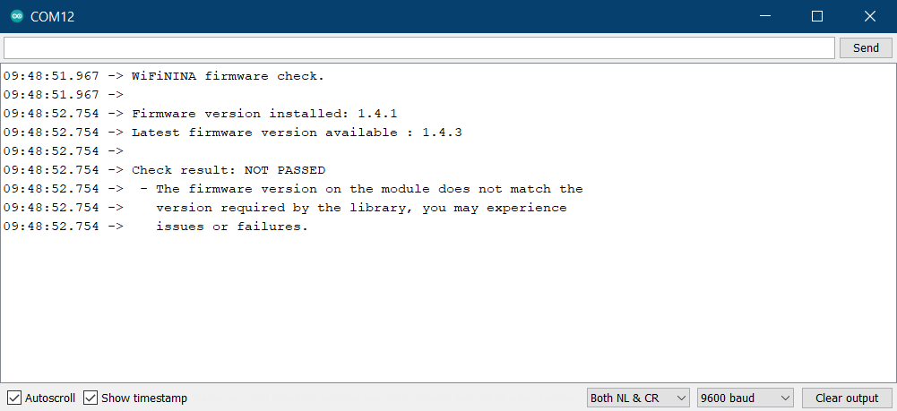

Learn how to check the firmware for WiFiNINA and WiFi101 modules, and update it using the Firmware Updater tool.

---

## Arduino IDE

### Check which firmware is used

Boards with the **WiFiNINA** library:

* Arduino MKR Vidor 4000
* Arduino MKR WiFi 1010
* Arduino Nano 33 IoT
* Arduino Nano RP2040 Connect
* Arduino UNO WiFi Rev2

Boards with the **WiFi101** library:

* Arduino MKR 1000 WiFi

### Check the firmware version

We can check the current firmware version by uploading a sketch to the board that will report the version via the serial monitor.

1. Connect the board to your computer and start Arduino IDE.

2. The **WiFiNINA** or **WiFi101** library needs to be installed, depending on the module. Open the Library Manager (_Tools > Manage Libraries..._) and make sure it's installed. For help with library installation, see [this guide](https://docs.arduino.cc/software/ide-v1/tutorials/installing-libraries).

3. With the library installed, open the firmware checking sketch:

   * **WiFiNINA::** _File > Examples > WiFiNINA > Tools > Select ‘CheckFirmwareVersion_.
   * **WiFi101:** _File > Examples > WiFi101 > CheckWifi101FirmwareVersion_.

4. Choose the port with your board in _Tools > Port_.

5. Click  **Upload** to upload the sketch to the board.

6. Open the Serial Monitor (_Tools > Serial Monitor_) and observe the output.

   

If the latest firmware is installed the output will include this line:

```
Check result: PASSED
```

But if a newer firmware version is available the output will look something like this:

```
WiFiNINA firmware check.

Firmware version installed: 1.4.7
Latest firmware version available : 1.4.8

Check result: NOT PASSED
 - The firmware version on the module does not match the
   version required by the library, you may experience
   issues or failures.
```

To update the firmware, follow the instructions below.
