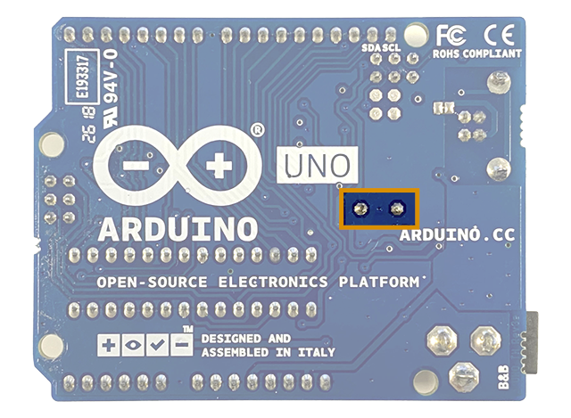

The following boards use either an Atmega16U2 or Atmega8U2 chip as a USB-to-serial converter:

* Arduino UNO (R3 or earlier, including SMD variants)
* Arduino Mega (Rev3 or earlier)
* Arduino Mega2560 Rev3
* Arduino MegaADK Rev3

If the Arduino firmware for these chips is missing or has been corrupted, it will no longer be possible to program the board over USB. However, Atmega16U2 or Atmega8U2 chips support a DFU (Device Firmware Upgrade) protocol that can be used to flash the Arduino firmware via USB, to restore USB-to-serial functionality.

You may want to try this procedure if:

* Your board is not being detected properly, and you already tried [the standard troubleshooting steps](https://support.arduino.cc/hc/en-us/articles/4412955149586-If-your-board-is-not-detected-by-Arduino-IDE).
* You have replaced the Atmega16U2 or Atmega8U2 with a new chip that is missing the Arduino firmware.

---

## 1. Get the firmware

The firmware is included in the **Arduino AVR Boards** package. When it's installed, you can find the firmware inside the [Arduino15 folder](https://support.arduino.cc/hc/en-us/articles/360018448279-Where-can-I-find-the-Arduino15-folder-):

* Windows: `%USERPROFILE%\AppData\Local\Arduino15\packages\arduino\hardware\avr\1.8.6\firmwares\atmegaxxu2\arduino-usbserial`
* macoS: `~/Library/Arduino15/packages/arduino/hardware/avr/1.8.6/firmwares/atmegaxxu2/arduino-usbserial`
* Linux: `~/.arduino15/packages/arduino/hardware/avr/1.8.6/firmwares/atmegaxxu2/arduino-usbserial`

You can also access the files from the [board package repository on GitHub](https://github.com/arduino/ArduinoCore-avr/tree/master/firmwares/atmegaxxu2/arduino-usbserial).

Do one of the following:

* Ensure that that **Arduino AVR Boards** package has been installed using Arduino IDE or Arduino CLI.
* [Download the firmware for your board from GitHub](https://github.com/arduino/ArduinoCore-avr/tree/master/firmwares/atmegaxxu2/arduino-usbserial).

Use the table below to find the correct firmware to use for your board:

| Board                 | Serial chip | Firmware                                       |
|:----------------------|:------------|:-----------------------------------------------|
| Arduino UNO R3        | Atmega16U2  | Arduino-usbserial-atmega16u2-Uno-Rev3.hex      |
| Arduino Mega2560 Rev3 | Atmega16U2  | Arduino-usbserial-atmega16u2-Mega2560-Rev3.hex |
| Arduino MegaADK Rev3  | Atmega16U2  | Arduino-usbserial-atmega16u2-MegaADK-Rev3.hex  |
| Arduino UNO (R1/R2)   | Atmega8U2   | Arduino-usbserial-uno.hex                      |
| Arduino Mega          | Atmega8U2   | Arduino-usbserial-mega.hex                     |

---

## 2. Connect your board with the Atmega16U2/8U2 in DFU mode

To enable DFU programming, the Atmega16U2/8U2 chip needs to be reset to DFU mode.

<!-- UNO (Rev3 or earlier), and Mega boards use either an Atmega16U2 or Atmega8U2 chip as a USB-to-serial converter. By setting a board to **DFU mode** (Device Firmware Update) you can [upload USB-to-Serial firmware to the chip](https://support.arduino.cc/hc/en-us/articles/4408887452434-Flash-USB-to-serial-firmware-in-DFU-mode). -->

Follow these steps:

1. Connect the board to your computer

1. **If you're using a "Rev 1" board:** If you're using an older revision (UNO Rev1 or Mega Rev1), you need to also assert and hold the **HWB line**. Find the two HWB pads on the back of the board and short them using something conductive, like a piece of wire.

   

1. Find the RESET and GND pins for the ATmega USB-Serial Processor. They are the innermost two pins of the six located close to the USB port.

   

1. Short the pins using a jumper cable or other  (follow [these instructions](#rev1) for UNO Rev1).

1. Short the RESET and GND pins to reset the board.

1. Release or remove any wires or other material before proceeding to the next step.

---

## 3. Program the chip

You can flash the firmware using dfu-programmer (recommended) or the original Atmel FLIP application (Windows only).

In this section:

* [Using dfu-programmer](#using-dfu-programmer)
* [Using Atmel FLIP](#using-atmel-flip)

### Using dfu-programmer {#using-dfu-programmer}

<a id="using-dfu-programmer-(macos%2Flinux)"></a> <!-- Maintain old anchor links -->

**[dfu-programmer](https://github.com/dfu-programmer/dfu-programmer)** is a lightweight, multi-platform command-line programmer that implements the Atmel FLIP USB DFU Protocol[^1].

[^1]: [The Atmel FLIP USB DFU protocol](https://ww1.microchip.com/downloads/en/AppNotes/doc8457.pdf) is based on part of official USB DFU specification, but does not implement it entirely. For this reason, Atmega16U2 or Atmega8U2 chips cannot be used with **dfu-util** or other tools that implement the main USB DFU specification.

Follow these steps:

1. Install dfu-programmer:

   * **Windows:** Download [the latest dfu-programmer release from GitHub](https://github.com/dfu-programmer/dfu-programmer/releases).

   * **macOS:** dfu-programmer requires the **libusb library** (libusb-1.0.0) to run. Manually installing libusb is complicated, so it's highly recommended to install dfu-programmer using the [homebrew package manager](https://brew.sh/), which will include libusb-1 as a dependency.

     When homebrew is installed, run this command in Terminal to install dfu-programmer:

     `brew install dfu-programmer`

   * **Linux:** Run this command in Terminal to install dfu-programmer:

     `sudo apt-get install dfu-programmer`

1. Open your system's command line application.

1. If you downloaded dfu-programmer from GitHub, move into the surrounding folder (for example, the Downloads folder):

   * Windows (cmd): `cd %USERPROFILE%\Downloads`
   * macOS/Linux: `cd ~/Downloads`

1. Erase the memory (replace `<atmegaxxu2>` with either `atmega8u2` or `atmega16u2`).

   * Windows: `dfu-programmer.exe <atmegaxxu2> erase`
   * macOS/Linux: `dfu-programmer <atmegaxxu2> erase`

1. Flash the firmware:

   * Windows: `dfu-programmer <atmegaxxu2> flash <firmware path>`
   * macOS/Linux: `dfu-programmer <atmegaxxu2> flash <firmware path>`

1. Disconnect and reconnect the board to your computer.

<!--

* **Example: UNO R3 (Windows):**
  ```
  TODO
  ```

* **UNO R3 (macOS/Linux):**
  ```
  dfu-programmer atmega16u2 flash ~/Library/Arduino15/packages/arduino/hardware/avr/1.8.6/firmwares/atmegaxxu2/arduino-usbserial/Arduino-usbserial-atmega16u2-Uno-Rev3.hex
  ```

* **Mega2560 Rev3 (Windows):**
  ```
  TODO %localappdata%
  ```

* **Mega2560 Rev3 (macOS/Linux):**
  ```
  dfu-programmer atmega16u2 flash ~/Library/Arduino15/packages/arduino/hardware/avr/1.8.6/firmwares/atmegaxxu2/arduino-usbserial/Arduino-usbserial-atmega16u2-Mega2560-Rev3.hex
  ```

-->

#### Example commands for dfu-programmer

> [!NOTE]
> The examples assume that version 1.8.6 of Arduino AVR Boards is installed.

##### UNO R3 on Windows

```
dfu-programmer.exe atmega16u2 flash %USERPROFILE%\AppData\Local\Arduino15\packages\arduino\hardware\avr\1.8.6\firmwares\atmegaxxu2\arduino-usbserial\Arduino-usbserial-atmega16u2-Uno-Rev3.hex
```

##### UNO R3 on macOS

```
dfu-programmer atmega16u2 flash ~/Library/Arduino15/packages/arduino/hardware/avr/1.8.6/firmwares/atmegaxxu2/arduino-usbserial/Arduino-usbserial-atmega16u2-Uno-Rev3.hex
```

##### UNO R3 on Linux

```
dfu-programmer atmega16u2 flash ~/.arduino15/packages/arduino/hardware/avr/1.8.6/firmwares/atmegaxxu2/arduino-usbserial/Arduino-usbserial-atmega16u2-Uno-Rev3.hex
```

##### Mega2560 Rev3 on Windows

```
dfu-programmer.exe atmega16u2 flash %USERPROFILE%\AppData\Local\Arduino15\packages\arduino\hardware\avr\1.8.6\firmwares\atmegaxxu2\arduino-usbserial\Arduino-usbserial-atmega16u2-Mega2560-Rev3.hex
```

##### Mega2560 Rev3 on macOS

```
dfu-programmer atmega16u2 flash ~/Library/Arduino15/packages/arduino/hardware/avr/1.8.6/firmwares/atmegaxxu2/arduino-usbserial/Arduino-usbserial-atmega16u2-Mega2560-Rev3.hex
```

##### Mega2560 Rev3 on Linux

```
dfu-programmer atmega16u2 flash ~/.arduino15/packages/arduino/hardware/avr/1.8.6/firmwares/atmegaxxu2/arduino-usbserial/Arduino-usbserial-atmega16u2-Mega2560-Rev3.hex
```

### Using Atmel FLIP {#using-atmel-flip}

<a id="using-flip-(windows)"></a> <!-- Maintain old anchor links -->

Before you begin:

1. Open Device Manager.

1. Expand the **libusb-win32-devices** category. If it is missing, [follow these steps](#install-libusb-win32) before proceeding.

1. Take a note of the device name, which should be either **ATmega16U2** or **ATmega8U2**.

Now flash the firmware using FLIP:

1. Download and install [FLIP](https://www.microchip.com/en-us/development-tool/flip).

1. Open FLIP.

    > [!NOTE]
    > Opening the application may prompt a 'Could not find a Java Virtual Machine' error. In this case, [install Java Runtime Environment](https://www.java.com/en/download/manual.jsp) with the **Windows Online** option.

1. Select the device name you identified earlier (ATmega16U2 or ATmega8U2).

1. Click the Cable button, select USB, then click Open.

    

1. In the menu, click _Device > Select..._

    

1. Click _File > Load HEX File..._

1. Select your driver `.hex` file and click 'OK'.

1. For Operational Flow, check **Erase**, **Program**, and **Verify** (this is the default setting).

    

1. Click on the 'Program Target Device Memory' button.

    

1. The firmware will be flashed, which may happen very quickly. A "Programming done" message should be displayed in the bottom-left corner.

    

1. Disconnect and reconnect the board to your computer.

#### Install the libusb-win32 driver in Device Manager {#install-libusb-win32}

1. Look for an **Unknown Device** under 'Other Devices'. Disconnect all devices except the board if multiple unknown devices are available.

2. Right-click and select **Update driver**.

   

3. Point to `C:\Program Files (x86)\Atmel\Flip 3.4.7`

4. Click 'Install' and wait for the installation to complete.

   

5. The device should now be recognized, under 'libusb-win32-devices'

   
