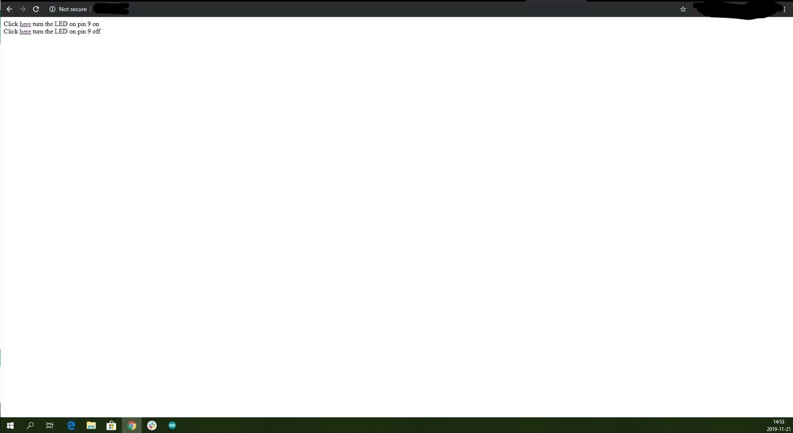

## Overview

This tutorial is about making a web server with static IP, using the web server example from the WiFi NINA library. The boards which support the WiFi Nina library are:

* MKR 1010
* UNO WiFi rev2
* Nano 33 IoT
* MKR VIDOR 4000

### What you’ll learn

* How to create a web server using static IP
* How to manage pins in the board using the web server

### Requirements

* WiFi Nina Compatible board
* Arduino IDE installed in the computer
* Wi-Fi connection.
* USB cable to connect the board to the computer.

## Steps

01. Select the board you will be working with.

02. In the Arduino IDE go to Files → Examples → WiFiNINA and click on `SimpleWebServerWiFi` example.

03. Add the Wi-Fi details you wish to connect in the `arduino_secrets.h` file.

04. Add `IPAddress ip('/*add the selected static IP here*/');` under the included library section like the code below:

    <iframe src=https://create.arduino.cc/editor/jojobaa/473fd181-12a3-4d42-bb56-c6adc385f457/preview?embed&snippet=L23-L34#L26 style="height:510px;width:100%;margin:10px 0" frameborder=0></iframe>

    <!-- [Code Snippet](https://create.arduino.cc/editor/jojobaa/473fd181-12a3-4d42-bb56-c6adc385f457/preview?embed&snippet=L23-L34#L26)-->

05. Make sure you add `WiFi.config(ip);` inside `void setup()`, like in the code below:

    <iframe src=https://create.arduino.cc/editor/jojobaa/473fd181-12a3-4d42-bb56-c6adc385f457/preview?embed&snippet=L35-L52#L46 style="height:510px;width:100%;margin:10px 0" frameborder=0></iframe>

    <!-- [Code Snippet](https://create.arduino.cc/editor/jojobaa/473fd181-12a3-4d42-bb56-c6adc385f457/preview?embed&snippet=L35-L52#L46)-->

06. Put in the Wi-Fi details you wish to connect to in the `arduino_secrets.h` file.

07. Check the LED details and make the required changes.

08. Upload the sketch and open the serial monitor once the upload is done.

09. The serial monitor shows the IP address board is connected to and also the link which you have to copy and paste in the browser.

10. Once you paste the link in the browser you will get a page that looks like the one in the image, where you can control the state of the built-in LED.

    
