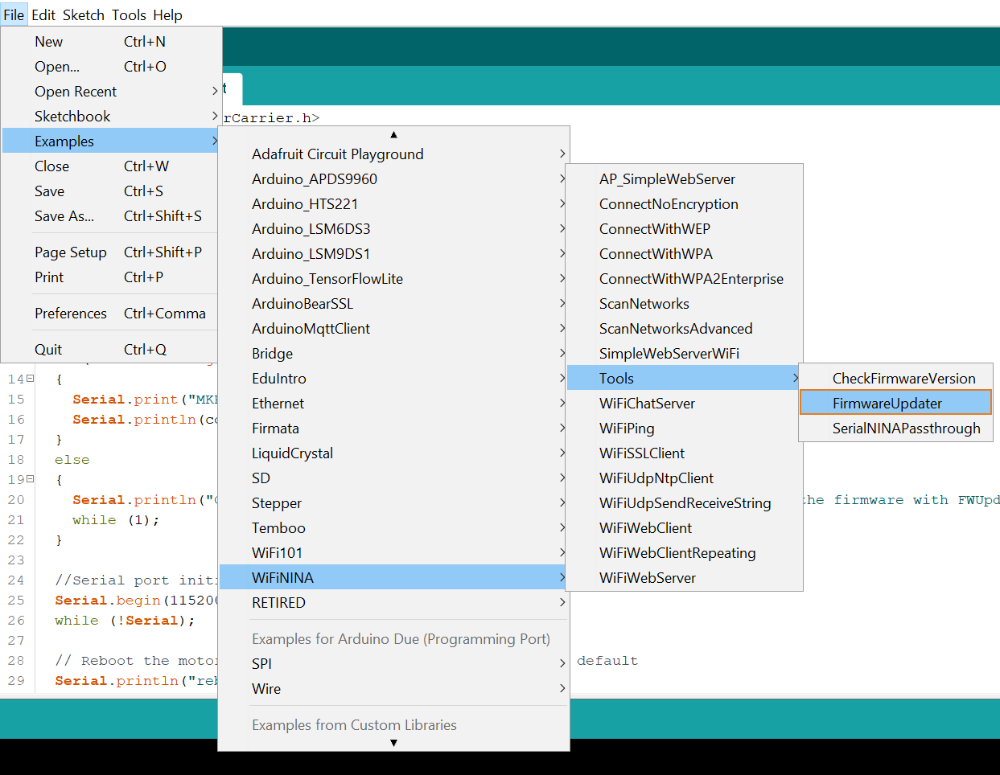
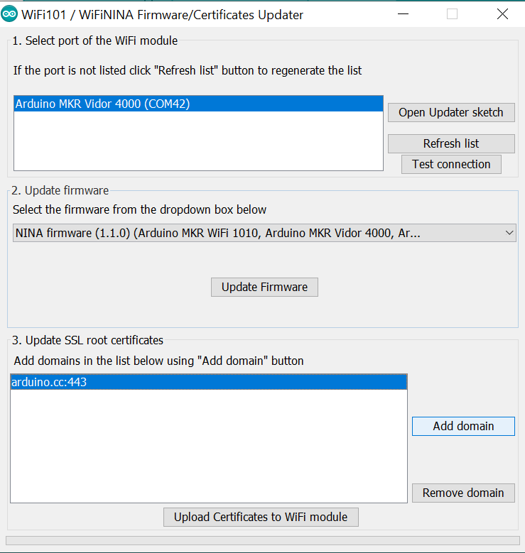
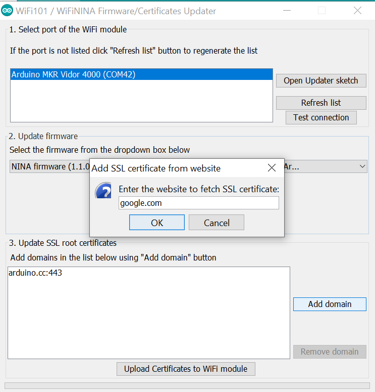
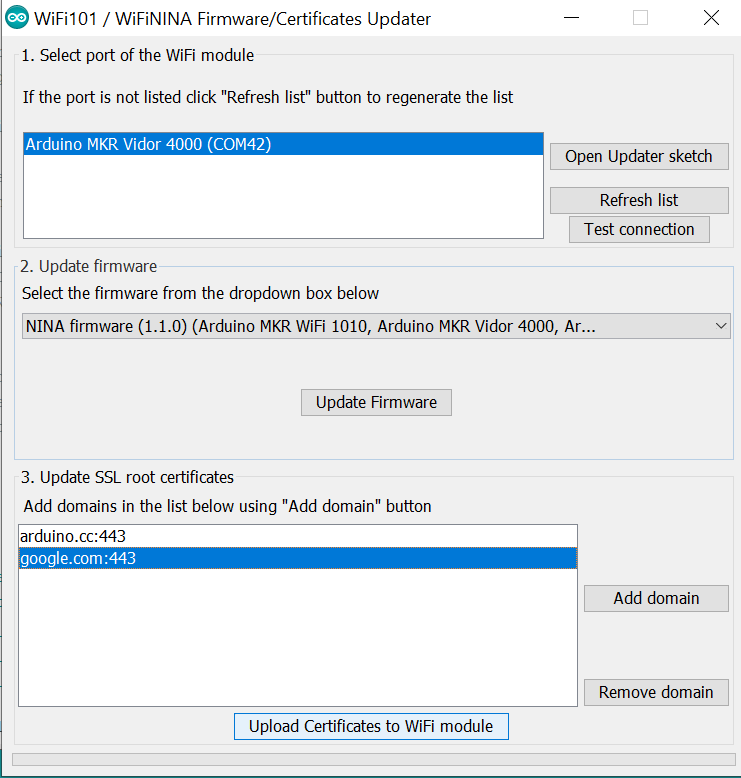
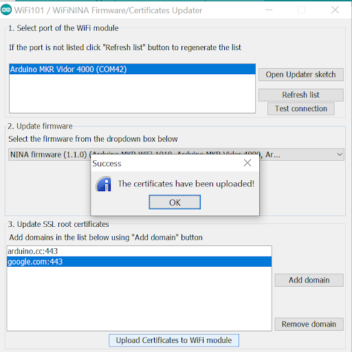

## Overview

Add certificates to your Wifi Nina/ Wifi 101 Module on an Arduino.

This guide will allow you to upload an SSL certificate in an easy way from your favorite https site on to your Arduino. Sometimes you may need to upload an SSL certificate on your Arduino which is not included with the board.

SSL certificates are used to create an encrypted channel between the client and the server.

Transmission of such data as credit card details, account login information, any other sensitive information has to be encrypted to prevent eavesdropping.

### What you’ll learn

You will learn how to add certificates to your Wi-Fi module on the Arduino using the Arduino IDE.

### Requirements

* Wifi Nina or Wifi 101 module compatible boards.
* Arduino IDE installed in your PC.
* USB 2.0 cable.
* Install the Wi-Fi module library according to the board you’re using:
  1. Open Arduino `IDE>Sketch>Include library>Manage libraries`
  2. Search for WifiNina or Wifi101 (depending on your board):
     * WifiNina: Arduino UNO WiFi Rev.2, Arduino Nano 33 IoT, Arduino MKR 1010, and Arduino MKR VIDOR 4000 WiFi.
     * Wifi101: Arduino WiFi Shield 101, and MKR1000 board.
  3. Install

## **Instructions:**

1. Connect your board to the PC via USB cable and select the right port and board in `Tools > Port` and `Tools > Board`.

2. Open the Arduino IDE and search for "Firmware updater" sketch that is in `Example > Wifi101/WiFiNINA > Firmware updater` and upload it to the board.

   

3. After the sketch has uploaded successfully, open `Tools > Wifi101/WifiNINA Firmware updater.`

   

4. Now that the firmware updater is launched, select the port of the Wi-Fi module you want to update. Skip section 2, since we are not updating the firmware in this tutorial.

5. In section 3, "Update SSL root certificate", click on `Add domain`.

   

6. A small dialogue box opens where you must enter the website from which you want to add the SSL certificate, then click `OK`.

   

7. Now, select the website in the list and click on `Upload Certificates to WiFi module.`

   

8. A small success dialogue box opens and your certificate is now uploaded to the board. Click on `OK`.

   

### Check

* If any of the above steps fail, you'll receive an upload error. If that happens, reset the board and try again.
* If you need another certificate just repeat this guide selecting the proper one you need.
* If a certificates is already on the board, it will be overwritten by the new one.
