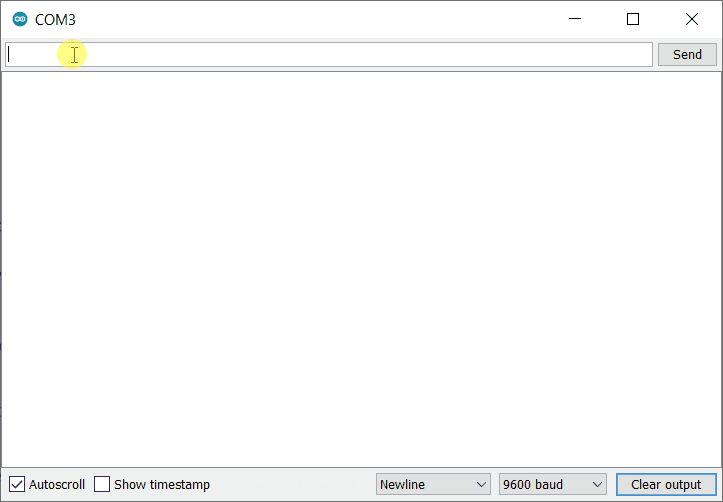

A **loopback test** is a troubleshooting procedure to test the serial communication between the PC and Arduino board with a dedicated USB to Serial converter chip.

## Supported boards

* Arduino UNO R3 (and older revisions) <!-- [X] Tested 2022-03-24 -->
* Arduino UNO R3 SMD <!-- [X] Tested 2022-03-24 -->
* Arduino Mega2560 Rev3 (and older revisions)
* Arduino Mega ADK Rev3
* Arduino Nano (classic) <!-- [X] Tested 2022-03-24 -->

## What you'll need

* 2 x female/female jumper cables (or some other way of connecting pins on the board)
* A data USB cable compatible with your board

## Performing the test

1. Disconnect the board from your computer or battery.

2. Remove any shield, jumper cables, or other connections to the board.

3. Connect a jumper cable from the **RESET** pin to any **GND** pin.

4. Connect a jumper cable from the **RX** pin to the **TX** pin.

   * On Mega boards, which have several serial ports, you can use **RX0** and **TX0**.

   * Wiring diagrams for UNO and Nano can be found in [Examples](#examples).

5. Open Arduino IDE or the [Cloud Editor](https://create.arduino.cc/editor).

6. Connect the board to your computer and select it with the Board selector. If your board is an Arduino Nano, you'll need to manually select "Arduino Nano". The Board selector is not available in IDE 1 – use the _Tools > Port_ and _Tools > Port_ menu options instead. To learn more, see [Select board and port in Arduino IDE](https://support.arduino.cc/hc/en-us/articles/4406856349970-Select-board-and-port-in-Arduino-IDE).

7. Open the Serial Monitor. If you're using Arduino IDE, click the  button in the top-right corner, or select _Tools > Serial Monitor_ in the menu bar. If you're using the Cloud Editor, select **Monitor** in the sidebar.

8. Enter a message and click Send. Your message should immediately be echoed by the board, and appear in the output field below.

   <figure style="margin-left:0;">
    
    <figcaption style="font-style: italic;">Performing a loopback test in the Arduino IDE serial monitor.</figcaption>
   </figure>

### If the loopback test failed

> [!NOTE]
> This test will always fail for the CH340 USB to serial chip used on some derivative boards.

A failed loopback test failed indicates that the USB to TTL serial adapter is damaged and that the board should be replaced. [Contact us](https://www.arduino.cc/en/contact-us/) for questions about warranty, or visit [the Arduino Store](https://store.arduino.cc/).

### If the loopback test passes

A successful loopback test means that the board can communicate with the computer but is unable to upload or run the sketch. This can be the result of a missing or corrupted bootloader. You can burn a new bootloader using another Arduino board as an ISP programmer, see [Burn the bootloader on UNO, Mega, and classic Nano using another Arduino](https://support.arduino.cc/hc/en-us/articles/4841602539164-Burn-the-bootloader-on-UNO-Mega-and-classic-Nano-using-another-Arduino).

## Examples

### Arduino UNO

### Arduino Nano

