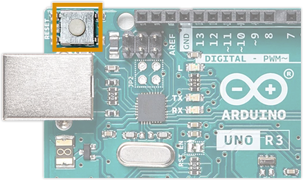

Learn about the different ways you can reset an Arduino.

---

## Reset (single press)

The RESET button is a white or blue push button located on top of your Arduino board. Pressing it has the same effect as disconnecting and reconnecting the power supply: The board will wait briefly for a new sketch to uploaded, then it will start executing any instructions in the sketch from the beginning. Powering down the board clears RAM memory, so values that were previously assigned to variables are not kept.



---

<a id="bootloader-mode"></a>

## Bootloader mode (double-press)

On some boards (such as those of the MKR Family and newer Nano boards), pressing the RESET button twice in quick succession will put the board in _bootloader mode_. Instead of running a sketch the Arduino will wait until a sketch is uploaded. While in bootloader mode, an orange LED will fade in and out.

This procedure does not in itself remove the stored sketch or otherwise change the board's configuration, and should not be understood as a "factory reset".


---

## Reset the sketch in memory

When uploading a sketch it will overwrite any sketch currently saved to the board's flash memory, so there is generally no need to clear or otherwise manage the flash storage manually. But if you want to remove the compiled sketch and not have the Arduino execute any instructions when powered, you can upload an "empty" sketch.

1. Connect the board to your computer and open Arduino IDE.

2. In the menu bar, select _File > Examples > 01.Basics > BareMinimum_ to open the `BareMinimum` sketch.

3. Select your board in _Tools > Board_.

4. Select the port with your board in _Tools > Port_.

5. Click  **Upload** to upload the sketch.

---

## Reset EEPROM Memory

AVR-based boards have an EEPROM, a non-volatile type of memory whose values are kept when the board is turned off.

The EEPROM can be reset using the `EEPROM.write()` function to set all the bytes to 0.

```arduino
/*
 * EEPROM Clear
 *
 * Sets all of the bytes of the EEPROM to 0.
 * Please see eeprom_iteration for a more in depth
 * look at how to traverse the EEPROM.
 *
 * This example code is in the public domain.
 */

#include <EEPROM.h>

void setup() {
  // initialize the LED pin as an output.
  pinMode(13, OUTPUT);

  /***
    Iterate through each byte of the EEPROM storage.
    Larger AVR processors have larger EEPROM sizes, E.g:
    - Arduino Duemilanove: 512 B EEPROM storage.
    - Arduino Uno:         1 kB EEPROM storage.
    - Arduino Mega:        4 kB EEPROM storage.
    Rather than hard-coding the length, you should use the pre-provided length function.
    This will make your code portable to all AVR processors.
  ***/

  for (int i = 0 ; i < EEPROM.length() ; i++) {
    EEPROM.write(i, 0);
  }

  // turn the LED on when we're done
  digitalWrite(13, HIGH);
}

void loop() {
  /** Empty loop. **/
}
```

To learn more, see [A guide to EEPROM](https://docs.arduino.cc/learn/programming/eeprom-guide).

---

## Reset the bootloader

A more persistent change to the board's configuration is changing or removing the bootloader. Restoring it requires burning (also called flashing) a new bootloader. The method and required equipment will vary depending on the board, start by checking these resources:

* [Burn the bootloader on UNO, Mega, and classic Nano using another Arduino](https://support.arduino.cc/hc/en-us/articles/4841602539164-Burn-the-bootloader-on-UNO-Mega-and-classic-Nano-using-another-Arduino)
* [Burning sketches to the Arduino board with an external programmer](https://docs.arduino.cc/hacking/software/Programmer)

---

## Further reading

* [Arduino Memory Guide](https://docs.arduino.cc/learn/programming/memory-guide#measuring-memory-usage-in-arduino-boards)
