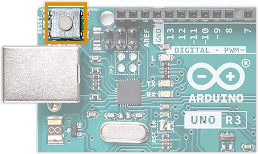
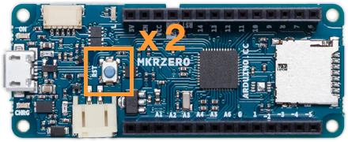

Learn about the different ways you can reset an Arduino board.

In this article:

<!-- TOC -->

- [Reset single press](#reset-single-press)
- [Bootloader mode double-press](#bootloader-mode-double-press)
- [Reset the board's sketch](#reset-the-sketch-in-memory)
- [Reset EEPROM Memory](#reset-eeprom-memory)
- [Reset the bootloader](#reset-the-bootloader)
- [Software reset](#software-reset)
- [Further reading](#further-reading)

<!-- /TOC -->

---

## Reset (single press)

The RESET button is a white or blue push button located on top of your Arduino board. Pressing it has the same effect as disconnecting and reconnecting the power supply: The board will wait briefly for a new sketch to uploaded, then it will start executing any instructions in the sketch from the beginning. Powering down the board clears RAM memory, so values that were previously assigned to variables are not kept.



---

<a id="bootloader-mode"></a>

## Bootloader mode (double-press)

On some boards (such as those of the MKR Family and newer Nano boards), pressing the RESET button twice in quick succession will put the board in _bootloader mode_. Instead of running a sketch the Arduino will wait until a sketch is uploaded. While in bootloader mode, an orange LED will fade in and out.

This procedure does not in itself remove the stored sketch or otherwise change the board's configuration, and should not be understood as a "factory reset".



---

## Reset the board's sketch {#reset-the-sketch-in-memory}

When uploading a new sketch, it will automatically overwrite any sketch currently saved to the board's flash memory. Therefore, there is generally no need to clear or manually manage the flash storage.

> [!NOTE]
> Arduino boards always store the last flashed sketched in memory, and will run it when powered. A sketch cannot be "removed", but it can be flashed with the pre-flashed factory sketch or an "empty" Sketch without instructions.

If you want to "factory reset" your board to its original state or ensure it does not run any custom code, you have two primary options:

### Restore the pre-flashed factory sketch

Most Arduino boards come pre-flashed from the factory with the `Blink` sketch, which blinks the primary built-in LED (usually labeled **L**) on and off. Restoring this sketch is the best way to return your board to its default state and visually confirm that it is working correctly.

To upload the `Blink` sketch in Arduino IDE:

1. Connect the board to your computer and open Arduino IDE.
2. Select your board in the **Board Selector** or **Tools > Board**/**Tools > Port** in the menu bar.
3. In the menu bar, select **File > Examples > 01.Basics > Blink**.
4. Click  **Upload** to upload the sketch.

Once the upload is complete, the built-in LED on your board should start blinking, confirming that the default sketch is running.

> [!NOTE]
> UNO R4 WiFi has a special pre-flashed sketch that plays an animation on the LED matrix. To restore that sketch, upload the `MatrixIntro` example (File > Examples > LED_Matrix > MatrixIntro).

### Upload an empty sketch

If you want the board to execute no instructions at all, you can upload the `BareMinimum` sketch. This sketch contains only the empty `setup()` and `loop()` functions required by the compiler.

To upload the `BareMinimum` sketch in Arduino IDE:

1. Connect the board to your computer and open Arduino IDE.
2. Select your board in the **Board Selector** or **Tools > Board**/**Tools > Port** in the menu bar.
3. In the menu bar, select **File > Examples > 01.Basics > BareMinimum** to open the **BareMinimum** sketch.
4. Click  **Upload** to upload the sketch.

---

## Reset EEPROM Memory

AVR-based boards have an EEPROM, a non-volatile type of memory whose values are kept when the board is turned off.

The EEPROM can be reset using the `EEPROM.write()` function to set all the bytes to 0.

```arduino
/*
 * EEPROM Clear
 *
 * Sets all of the bytes of the EEPROM to 0.
 * Please see eeprom_iteration for a more in depth
 * look at how to traverse the EEPROM.
 *
 * This example code is in the public domain.
 */

#include <EEPROM.h>

void setup() {
  // initialize the LED pin as an output.
  pinMode(13, OUTPUT);

  /***
    Iterate through each byte of the EEPROM storage.
    Larger AVR processors have larger EEPROM sizes, E.g:
    - Arduino Duemilanove: 512 B EEPROM storage.
    - Arduino Uno:         1 kB EEPROM storage.
    - Arduino Mega:        4 kB EEPROM storage.
    Rather than hard-coding the length, you should use the pre-provided length function.
    This will make your code portable to all AVR processors.
  ***/

  for (int i = 0 ; i < EEPROM.length() ; i++) {
    EEPROM.write(i, 0);
  }

  // turn the LED on when we're done
  digitalWrite(13, HIGH);
}

void loop() {
  /** Empty loop. **/
}
```

To learn more, see [A guide to EEPROM](https://docs.arduino.cc/learn/programming/eeprom-guide).

---

## Reset the bootloader

A more persistent change to the board's configuration is changing or removing the bootloader. Restoring it requires burning (also called flashing) a new bootloader. The method and required equipment will vary depending on the board, start by checking these resources:

- [Burn the bootloader on UNO, Mega, and classic Nano using another Arduino](https://support.arduino.cc/hc/en-us/articles/4841602539164-Burn-the-bootloader-on-UNO-Mega-and-classic-Nano-using-another-Arduino)
- [Burning sketches to the Arduino board with an external programmer](https://docs.arduino.cc/hacking/software/Programmer)

---

## Software reset

Depending on the microcontroller architecture of your board, it can be possible to reset the board programmatically from within your sketch.

> [!TIP]
> Performing an intentional software reset is generally considered a bad programming pattern. In most cases, it is better to handle the state of your application using proper programming logic and state machines rather than forcing the microcontroller to restart.

### ARM-based boards (e.g., Nano 33 BLE, Portenta, UNO R4)

For boards featuring an ARM Cortex-M processor you can use `NVIC_SystemReset()`.

These boards can be found in packages like:

- **Arduino SAMD Boards (32-bits ARM Cortex-M0+)** (e.g., Zero, MKR family, Nano 33 IoT)
- **Arduino SAM Boards (32-bits ARM Cortex-M3)** (Due)
- **Arduino UNO R4 Boards** (UNO R4 Minima/WiFi)
- **Arduino Renesas Portenta Boards** (Portenta C33)
- **Arduino Mbed OS ... Boards** (Nano 33 BLE, Nano RP2040 Connect, Giga R1, Portenta H7, Nicla, Opta)
- **Silicon Labs** (Nano Matter)

`NVIC_SystemReset()` is a standard hardware-level function provided by the **CMSIS** (Cortex Microcontroller Software Interface Standard) library. When called, it immediately triggers a system reset request at the core hardware level, restarting the microcontroller as if the physical reset button was pressed.

To implement a software reset on ARM boards:

```arduino
NVIC_SystemReset();
```

You do not need to import any libraries to use this function.

### AVR-based boards (e.g., UNO R3, Mega 2560)

AVR-based microcontrollers do not have a built-in software reset instruction. The most reliable and standard way to trigger a reset programmatically is to use the **Watchdog Timer (WDT)**.

By enabling the Watchdog Timer with a very short timeout (e.g., 15 milliseconds) and entering an infinite loop, you force the hardware timer to expire, which triggers a complete hardware reset of the microcontroller.

> [!CAUTION]
> If your board is running an old bootloader, using the Watchdog Timer can cause an infinite reset loop. This happens because the older bootloader does not disable the watchdog after a reset, causing it to trigger again before your sketch starts. Disable the watchdog at the very beginning of your `setup()` function to prevent this (see the example below).

To implement a software reset on AVR boards:

```arduino
#include <avr/wdt.h>

void setup() {
  // Clear the reset flag and disable the watchdog immediately 
  // to prevent infinite reset loops in older bootloaders.
  MCUSR = 0;
  wdt_disable();
  
  // Your other setup code...
}

void loop() {
  // ...
}

// Call this function to reset the board
void softwareReset() {
  wdt_enable(WDTO_15MS);
  while (1) {}
}
```

---

## Further reading

- [Arduino Memory Guide](https://docs.arduino.cc/learn/programming/memory-guide#measuring-memory-usage-in-arduino-boards)
