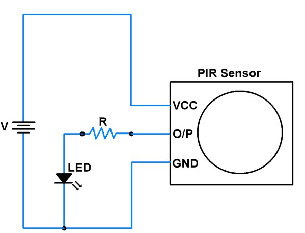
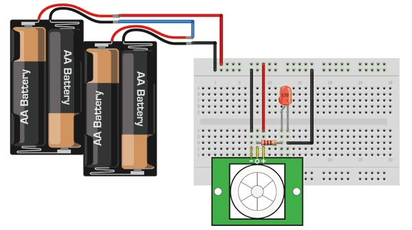

A PIR sensors allows us to sense motion by measuring infrared (IR) light radiating from the object in its field of view. When it fails to do this, the following steps can be taken to troubleshoot it and adjust it's sensitivity:

1. Wire the PIR sensor to the breadboard according to the circuit diagram below making sure that power supply Ground (GND) will connect to the negative (GND) pin of the sensor and the supply positive(VIN) will connect to the positive (VCC) pin of the PIR sensor as shown below.

   

2. Connect a resistor within the range of 0.1KΩ to 1KΩ from the OUT pin of the PIR sensor to the anode (positive) pin of an LED (any color) and connect the cathode (negative) pin of the LED to Ground (GND). Note that the LED and the resistor can switch positions.

   

3. Connect the power supply for the set-up to the breadboard. The recommended power supply should be within 3.3 and 5.0 volts.

4. Place the PIR sensor on a flat surface like a table or wall so that it is facing parallel to the scanning surface.

5. Cross check the circuit wiring to ensure it is properly done, and then turn on the power supply to test the PIR motion sensor.

6. Wait for the PIR sensor to calibrate properly, this will normally take from 10 to 60 seconds. If the LED is on, please wait until the LED turns off.

7. Finally, make a gesture or movement in front of the sensor, if the sensor is working properly, the voltage value will occur and the LED will turn on if/when the sensor detects the motion.

  This adjustment is needed if your PIR is too sensitive or not sensitive enough (clockwise turn makes it more sensitive). However, If there is no detection when the circuit is properly wired, then the sensor is faulty.

   
