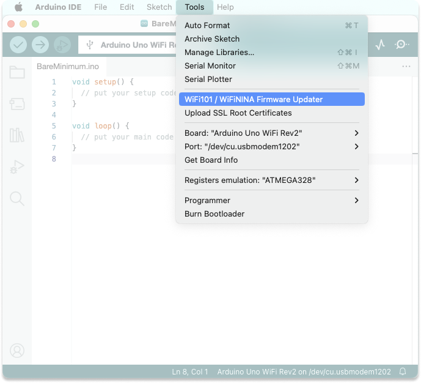
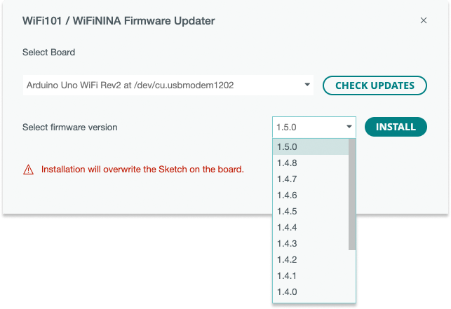
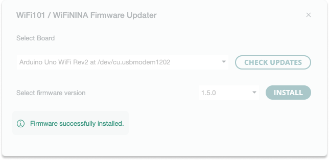
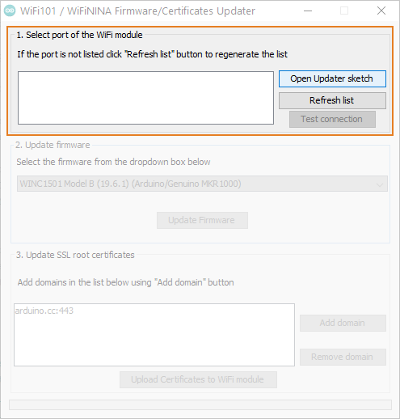
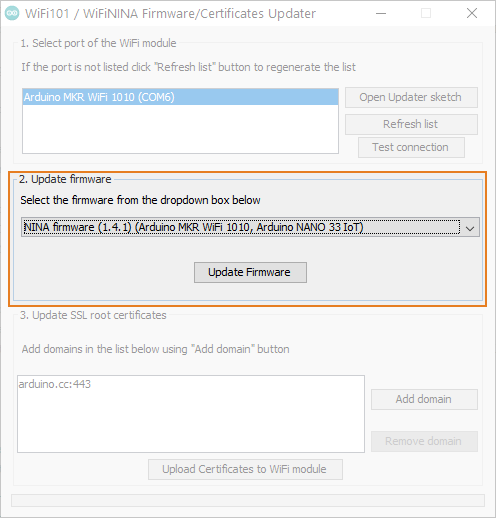
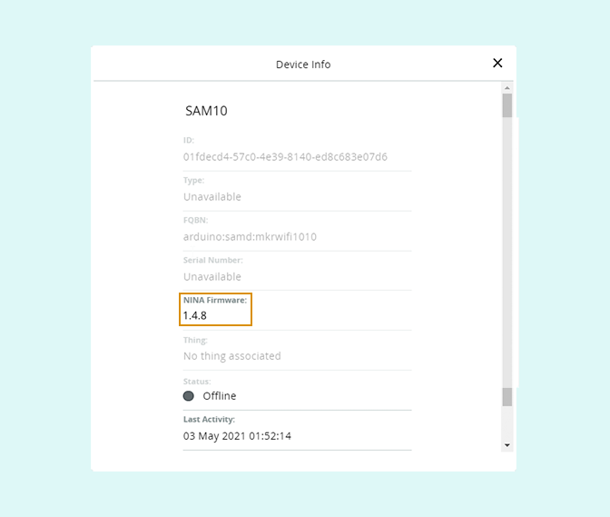
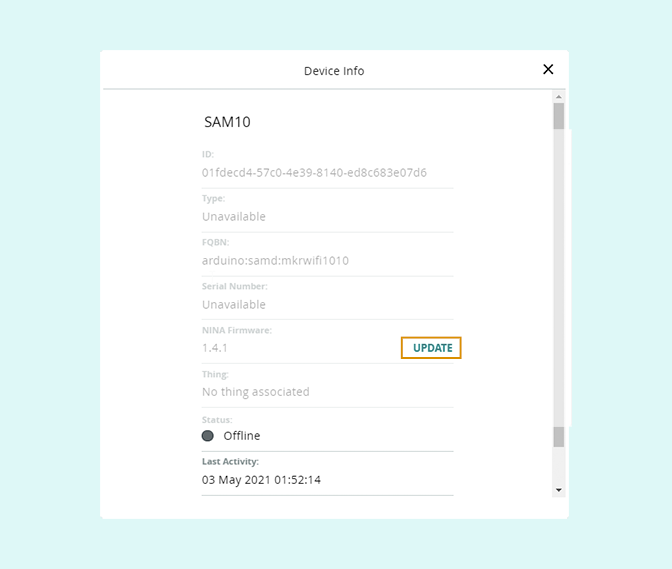

Learn how to update the firmware for the WiFi101 and WiFiNINA communication libraries used on these boards:

* [Arduino MKR WiFi 1010](https://store.arduino.cc/arduino-mkr-wifi-1010)
* [Arduino MKR Vidor 4000](https://store.arduino.cc/arduino-mkr-vidor-4000)
* [Arduino Nano 33 IoT](https://store.arduino.cc/arduino-nano-33-iot)
* [Arduino UNO WiFi Rev2](https://store.arduino.cc/arduino-uno-wifi-rev2)
* [Arduino Nano RP2040 Connect](https://store.arduino.cc/collections/boards/products/arduino-nano-rp2040-connect)
* [Arduino MKR 1000 WiFi](https://docs.arduino.cc/hardware/mkr-1000-wifi)

In this article:

* [Update the firmware in Arduino IDE 2](#update-the-firmware-in-arduino-ide-2)
* [Update the firmware in Arduino IDE 1](#update-the-firmware-in-arduino-ide-1)
* [Update the firmware in Arduino IoT Cloud](#update-the-firmware-in-arduino-iot-cloud)

---

## Update the firmware in Arduino IDE 2

To update the firmware in Arduino IDE 2, follow these steps:

1. Connect the board to your computer and open the Arduino IDE 2.

2. In the top menu bar, open **Tools > WiFi101 / WiFiNINA Firmware Updater**.

    

3. A new window will open. Select your board on the drop-down menu and click *CHECK UPDATES*

    

4. Select the latest firmware version on the drop-down menu and click *INSTALL* (Note that the installation will overwrite any existing sketch on your board).

    

5. "Firmware successfully installed" will be displayed when the process is finished.

    

## Update the firmware in Arduino IDE 1

To update the firmware in Arduino IDE 1, follow these steps:

1. Connect the board to your computer and make sure the Serial Monitor is not open.

2. In the top menu bar, open **Tools > WiFi101 / WiFiNINA Firmware Updater**.

3. In the *1. Select port of the WiFi module* area, select your board in the list (If the board is not listed, make sure it is connected, and click 'Refresh list'). Finally, click *Open Updater sketch*.

   

4. Upload the sketch by clicking  **Upload**. Then, go back to the Firmware Updater window from before.

5. In the *2. Update firmware* area, select the latest firmware version in the drop-down menu. Then, click *Update Firmware*.

   

6. Wait for the firmware update to complete (the process may take up to a minute to complete). A successful update will be confirmed by a pop-up.

<a id="arduino-iot-cloud">

## Update the firmware in Arduino IoT Cloud

The firmware can also be managed in Arduino IoT Cloud.

### Check the firmware version

1. Open the [Device tab](https://create.arduino.cc/iot/devices).

2. Click the row with your device.

3. See the firmware for NINA or WIFI 101.

   

### Update the firmware

If a new firmware version has been released for a device added to IoT Cloud:

1. Open the [Device tab](https://create.arduino.cc/iot/devices).

2. Click the row with your device.

3. Click the firmware UPDATE button.

   

Alternatively, you can remove and add the device again. When adding the device, the firmware is automatically updated with the latest firmware version.

1. Connect the board to your computer and make sure the Serial Monitor is not open.

2. Open the [Device tab in Arduino IoT Cloud](https://create.arduino.cc/iot/devices).

3. Remove the device if it's been previously added by clicking the three dots, then _Remove_.

4. Click 'Add Device' and follow the instructions for [adding your device](https://support.arduino.cc/hc/en-us/articles/360016495559-How-to-add-Arduino-devices-to-the-Arduino-IoT-cloud).

Your device should be updated with the latest firmware version.
