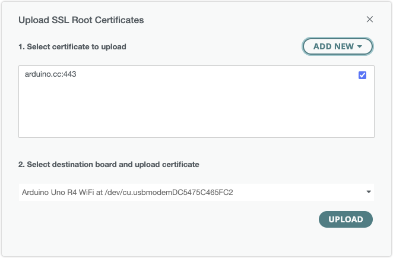
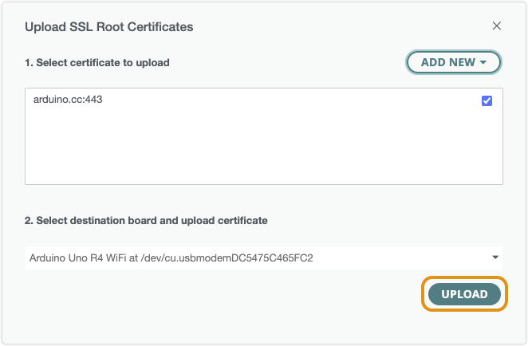
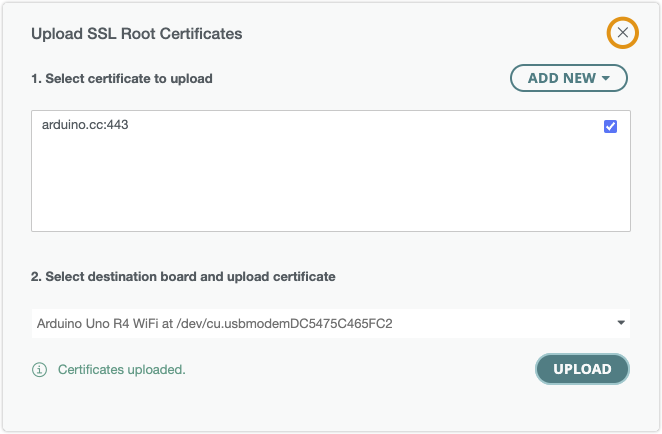

Learn how to upload (flash) **SSL root certificates** to your board using Arduino IDE or the Arduino Firmware Uploader CLI utility.

In this article:

* [Supported boards](#supported-boards)
* [Uploading certificates in Arduino IDE](#arduino-ide)
* [Uploading certificates using Arduino Firmware Uploader](#arduino-firmware-uploader)

---

## Supported boards

The Firmware Updater tool in Arduino IDE supports[^deprecated] these boards and modules:

| Board                 | Module   |
|-----------------------|----------|
| Arduino UNO R4 WiFi   | ESP32-S3 |
| Arduino Portenta C33  | ESP32-C3 |
| Arduino MKR WiFi 1010 | NINA     |
| Arduino NANO 33 IoT   | NINA     |
| Arduino Uno WiFi Rev2 | NINA     |
| Arduino Nano RP2040   | NINA     |

[^deprecated]: MKR 1000 WiFi and MKR Vidor 4000 are not supported in Arduino IDE 2.2.0 / Arduino Firmware Uploader 2.4 or later. To update these boards, use Arduino IDE [2.2.1](https://github.com/arduino/arduino-ide/releases/tag/2.1.1) or Arduino Firmware Uploader [2.3.0](https://github.com/arduino/arduino-fwuploader/releases/tag/2.3.0). For more information, see the [Arduino Firmware Uploader user documentation](https://arduino.github.io/arduino-fwuploader/latest/deprecated/).

---

## Upload SSL root certificates in Arduino IDE

Follow these steps to upload SSL root certificates in Arduino IDE 2:

1. Connect the board to your computer and open Arduino IDE 2.

1. If the Serial Monitor is open, close it.

1. In the top menu bar, open **Tools > Upload Root Certificates**[^1.8.9].

   

1. Configure the options:

   * To add more certificates, click the **Add New** button, enter a URL, and press the <kbd>Enter</kbd> key.

   * Check one or more certificates that you want to upload.

   * Select the destination board in the board selection menu.

1. Click the **Upload** button.

   

1. Wait until the text "Certificates uploaded" is displayed, then close the Firmware Updater by clicking the "x" in the top-right corner.

   

[^1.8.9]: In Arduino IDE 1.8.9, this option is combined with the Firmware Updater and called **Wifi101/WifiNINA Firmware updater**.

---

## Upload SSL root certificates with the Arduino Firmware Uploader

If you prefer, you can directly use the Arduino Firmware Uploader (arduino-fwuploader) from the command line.

See the [usage guide for certificates](https://arduino.github.io/arduino-fwuploader/2.4/usage/#certificates) and check the command reference for [certificates](https://arduino.github.io/arduino-fwuploader/latest/commands/arduino-fwuploader_certificates/) and [certificates flash](https://arduino.github.io/arduino-fwuploader/2.4/commands/arduino-fwuploader_certificates_flash/).

[^deprecated]: MKR 1000 WiFi and MKR Vidor 4000 are not supported in Arduino IDE 2.2.0 / Arduino Firmware Uploader 2.4 or later. To update these boards, use Arduino IDE [2.2.1](https://github.com/arduino/arduino-ide/releases/tag/2.1.1) or Arduino Firmware Uploader [2.3.0](https://github.com/arduino/arduino-fwuploader/releases/tag/2.3.0). For more information, see the [Arduino Firmware Uploader user documentation](https://arduino.github.io/arduino-fwuploader/latest/deprecated/).
