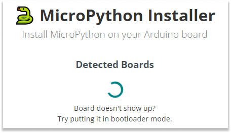

These are some reasons you may want to upload firmware for Arduino Lab for Micropython:

- Enable MicroPython on boards that initially come with the Arduino bootloader.

- Restore MicroPython firmware after an Arduino sketch has been flashed.

- Update the MicroPython firmware to a newer version.

## Supported Boards

- Arduino Giga
- Arduino Nano 33 BLE Sense
- Arduino Nano ESP32
- Arduino Nano RP2040 Connect
- Arduino Nicla Vision
- Arduino Portenta C33
- Arduino Portenta H7
- Arduino Primo

## Instructions

1. Download [the MicroPython Installer](https://github.com/arduino/lab-micropython-installer/releases/tag/v1.3.1) for your operating system:

    - **Windows:** Download [MicroPython.Installer-1.3.1.Windows-Setup.exe](https://github.com/arduino/lab-micropython-installer/releases/download/v1.3.1/MicroPython.Installer-1.3.1.Windows-Setup.exe) and run the installer.

    - **macOS:** Download [MicroPython.Installer-macOS-x64-1.3.1.zip](https://github.com/arduino/lab-micropython-installer/releases/download/v1.3.1/MicroPython.Installer-macOS-x64-1.3.1.zip), extract the zip file, and move the application to your Applications folder.

    - **Linux:** Download [micropython-installer_1.3.1_Linux.deb](https://github.com/arduino/lab-micropython-installer/releases/download/v1.3.1/micropython-installer_1.3.1_Linux.deb) and install it using your package manager.
        - `sudo dpkg -i micropython-installer_1.3.1_Linux.deb`.

    - **NuGet Package:** Download [MicroPythonInstaller-1.3.1-full.nupkg](https://github.com/arduino/lab-micropython-installer/releases/download/v1.3.1/MicroPythonInstaller-1.3.1-full.nupkg) if you are using NuGet for package management.

1. Launch the Firmware Installer tool.

1. Let the installer detect your board

    

1. Press the 'Install MicroPython' button.

1. Wait for Installation. After a few seconds, your board will be ready to go!

If the installer doesn't automatically find the MicroPython firmware, you can [download it manually](https://docs.arduino.cc/c7a1ad0b2941edc9f7c46d6a6efaea0c/nanoesp32_micropython.bin).
