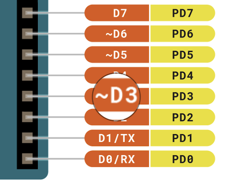

Learn how to use PWM (Pulse Width Modulation) output with Arduino.

---

## Using PWM in your sketch

Add PWM output to your sketch using the [analogWrite()](https://www.arduino.cc/reference/en/language/functions/analog-io/analogwrite/) function.

Here's a basic example:

```arduino
int ledPin = 9;      // LED connected to digital pin 9
int analogPin = 3;   // potentiometer connected to analog pin 3
int val = 0;         // variable to store the read value

void setup() {
  pinMode(ledPin, OUTPUT);  // sets the pin as output
}

void loop() {
  val = analogRead(analogPin);  // read the input pin
  analogWrite(ledPin, val / 4); // analogRead values go from 0 to 1023, analogWrite values from 0 to 255
}
```

---

## Change the PWM resolution

You can modify the resolution of PWM signals using the `analogWriteResolution()` function. By default, the resolution is 8 bits, meaning values passed to `analogWrite()` can range between 0-255, which ensures backward compatibility with AVR-based boards.

To change the resolution, use `analogWriteResolution(bits)`, where `bits` determines the resolution in bits, ranging from 1 to 32. If the resolution set is higher than your board’s capabilities, extra bits will be discarded. If it's lower than your board’s capabilities, the missing bits will be padded with zeros

```arduino
void setup() {
  Serial.begin(9600);
  pinMode(11, OUTPUT);
}

void loop() {
  int sensorVal = analogRead(A0);  // Read the analog input from A0

  // Set PWM resolution to 12 bits
  analogWriteResolution(12);
  analogWrite(12, map(sensorVal, 0, 1023, 0, 4095));

  // Print the mapped 12-bit PWM value to the serial monitor
  Serial.print("12-bit PWM value: ");
  Serial.print(map(sensorVal, 0, 1023, 0, 4095));
}
```

---

## Recommended PWM pins

### Overview for common boards

| Board                                      | PWM Pins *                     |
|--------------------------------------------|--------------------------------|
| UNO (R3 and earlier), Nano, Mini           | 3, 5, 6, 9, 10, 11             |
| UNO R4 (Minima, WiFi)                      | 3, 5, 6, 9, 10, 11             |
| Mega                                       | 2 - 13, 44 - 46                |
| GIGA R1                                    | 2 - 13                         |
| Leonardo, Micro, Yún                       | 3, 5, 6, 9, 10, 11, 13         |
| UNO WiFi Rev2, Nano Every                  | 3, 5, 6, 9, 10                 |
| MKR boards**                               | 0 - 8, 10, A3, A4              |
| MKR1000 WiFi**                             | 0 - 8, 10, 11, A3, A4          |
| Zero**                                     | 3 - 13, A0, A1                 |
| Nano 33 IoT**                              | 2, 3, 5, 6, 9 - 12, A2, A3, A5 |
| Nano 33 BLE/BLE Sense                      | 1 - 13, A0 - A7                |
| Due***                                     | 2-13                           |
| 101                                        | 3, 5, 6, 9                     |

<b>\*</b>These pins are officially supported PWM pins. While some boards have additional pins capable of PWM, using them is recommended only for advanced users that can account for timer availability and potential conflicts with other uses of those pins.<br>
<b>\*\*</b>In addition to PWM capabilities on the pins noted above, the MKR, Nano 33 IoT, and Zero boards have true analog output when using `analogWrite()` on the `DAC0` (`A0`) pin.<br>
<b>\*\*\*</b>In addition to PWM capabilities on the pins noted above, the Due has true analog output when using `analogWrite()` on pins `DAC0` and `DAC1`.

### Finding PWM pins in the pinout diagrams

The **pinouts** for many boards specifify the recommended PWM pins with a tilde (**~**) symbol:



You can find pinouts on [Arduino Docs](https://docs.arduino.cc/).

---

## Additional PWM pins

Many newer boards support PWM on additional pins, but their use is subject to timer availability.

---

## Further reading

* [Basics of PWM](https://docs.arduino.cc/learn/microcontrollers/analog-output)
