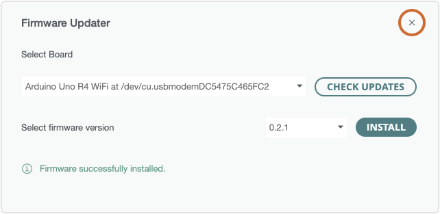

Learn how to use the **Firmware Updater** tool in Arduino IDE.

In this article:

* [Arduino IDE (2.2.0 or later)](#arduino-ide-2)
* [Arduino IDE 1.8.19](#arduino-ide-1)
* [Other methods for updating firmware](#other)

---

## Arduino IDE (2.2.0 or later)

### Supported boards

The Firmware Updater tool in Arduino IDE supports[^deprecated] these boards and modules:

| Board                 | Module   |
|-----------------------|----------|
| Arduino UNO R4 WiFi   | ESP32-S3 |
| Arduino Portenta C33  | ESP32-C3 |
| Arduino MKR WiFi 1010 | NINA     |
| Arduino NANO 33 IoT   | NINA     |
| Arduino Uno WiFi Rev2 | NINA     |
| Arduino Nano RP2040   | NINA     |

[^deprecated]: MKR 1000 WiFi and MKR Vidor 4000 are not supported in Arduino IDE 2.2.0 / Arduino Firmware Uploader 2.4 or later. To update these boards, use Arduino IDE [2.2.1](https://github.com/arduino/arduino-ide/releases/tag/2.1.1) or Arduino Firmware Uploader [2.3.0](https://github.com/arduino/arduino-fwuploader/releases/tag/2.3.0). For more information, see the [Arduino Firmware Uploader user documentation](https://arduino.github.io/arduino-fwuploader/latest/deprecated/).

### Updating the firmware

Follow these steps to update your board's wireless connectivity firmware using Arduino IDE 2:

1. Connect the board to your computer and open Arduino IDE 2.

2. If the Serial Monitor is open, close it.

3. In the top menu bar, open **Tools > Firmware Updater**[^1].

    

4. Select your board on the drop-down menu and click the **Check Updates** button.

    

5. Select the latest firmware version on the drop-down menu and click **Install**

   > **Note:** Installation will overwrite any existing sketch on your board.

    

6. When the text "Firmware successfully installed" is displayed.

    

7. If you're using the **UNO R4 WiFi**, disconnect and reconnect the board from your computer.

   > **Warning:** After flashing the firmware on the UNO R4 WiFi, the board will remain in **ESP Download** mode until you disconnect and reconnect it from your computer. If you upload a sketch while the board is in ESP Mode, it will erase the special firmware that lets the ESP32 chip function as an USB bridge.

8. Close the Firmware Updater by clicking the "x" in the top-right corner of the Firmware Updater window.

    

[^1]: In version 2.1.1 and earlier, this was called **Tools > WiFi101 / WiFiNINA Firmware Updater**.

---

## Arduino IDE 1.8.19

> **Note:** Arduino IDE 1.8.19 is no longer being maintained and uses an older version of the Arduino Firmware Uploader. Because of this, it does not support newer boards like UNO R4 WiFi or Portenta C33.

To update the firmware in Arduino IDE 1.8.19, follow these steps:

1. Connect the board to your computer and make sure the Serial Monitor is not open.

2. In the top menu bar, open **Tools > WiFi101 / WiFiNINA Firmware Updater**.

3. In the "1. Select port of the WiFi module" area, select your board in the list. If the board is not listed, make sure it is connected, and click "Refresh list". Finally, click **Open Updater sketch**.

   

4. Make sure you have the right board selected in **Tools > Port**, then click the  **Upload** button to upload the Updater sketch.

5. Close the Updater sketch and go back to the IDE window with the Updater tool.

6. In the "2. Update firmware" area, select the firmware version you want to upload from, and click the **Update Firmware** button.

   

7. Wait for the firmware update to complete (the process may take up to a minute to complete). A successful update will be confirmed by a pop-up.

---

## Other methods for updating firmware

* To use the **arduino-fwuploader** CLI utility, check the <a class="link-external" href="https://arduino.github.io/arduino-fwuploader/latest/">Arduino Firmware Uploader user documentation</a>.
