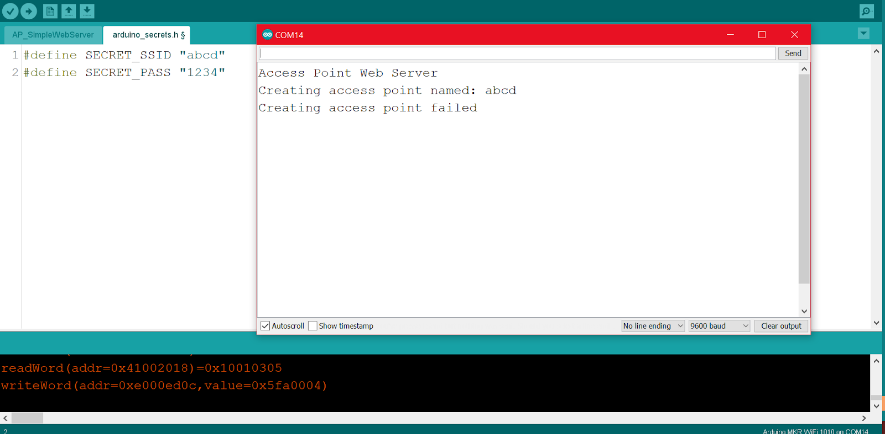
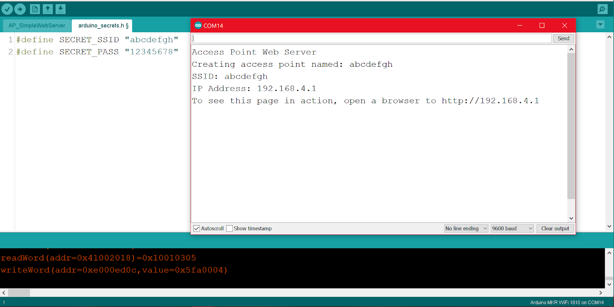
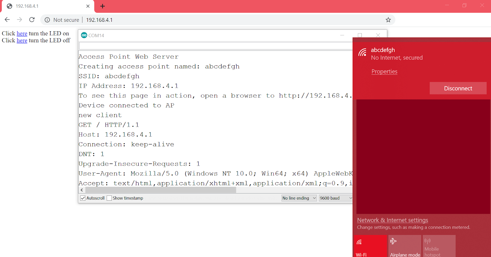

`AP_SimpleWebServer` is a simple web server to manage a LED with AP features. The boards which support the WiFi Nina library are:

* MKR 1010
* UNO WiFi rev2
* Nano 33 IoT
* MKR VIDOR 4000

Having the `AP_SimpleWebServer` sketch example already uploaded in the board, if the serial monitor shows the “Create access point failed” error, troubleshoot it following this steps:

1. Initialize the parameters as below:

   * ssid: the SSID (Service Set IDentifier) of the created Access Point.
   * passphrase: optional, the WPA password of the created Access Point.

   > Note: The ssid and passphrase **must be** 8 or more characters. Otherwise the serial monitor will display this error.

2. Upload the `Ap_SimpleWebServer` sketch again, then open the serial monitor.
  

3. Now, the board needs to connect to the Wi-Fi named with SSID: “abcdefgh” in your Wi-Fi networks.

4. Once the board is connected, open the web browser and enter the IP address shown in the Serial monitor.

   

5. Finally, the LED of the board can be controlled over the Wi-Fi network.
