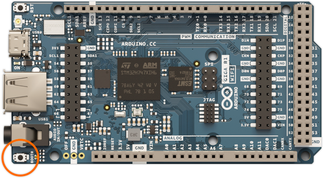
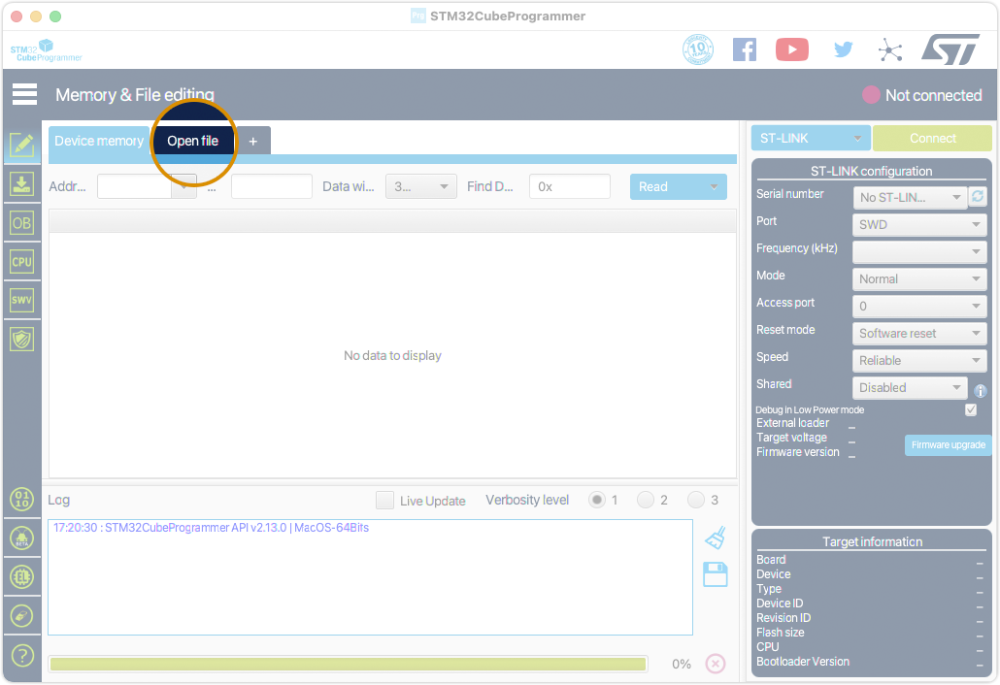
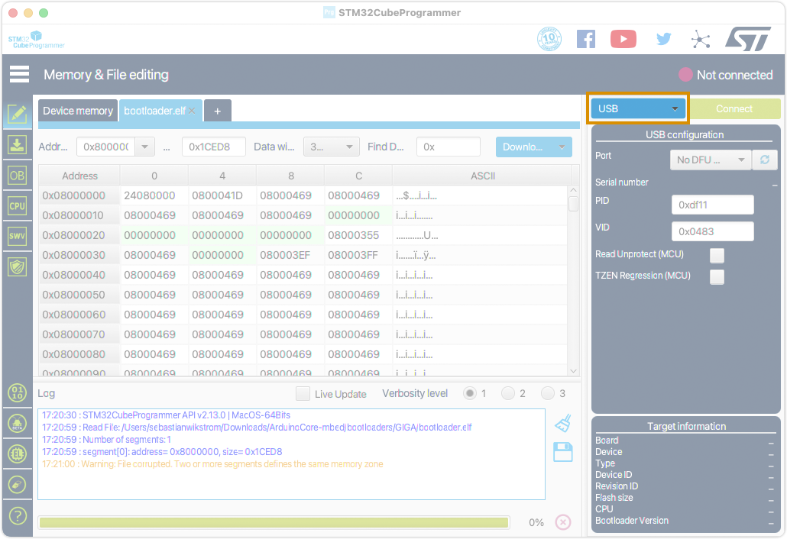
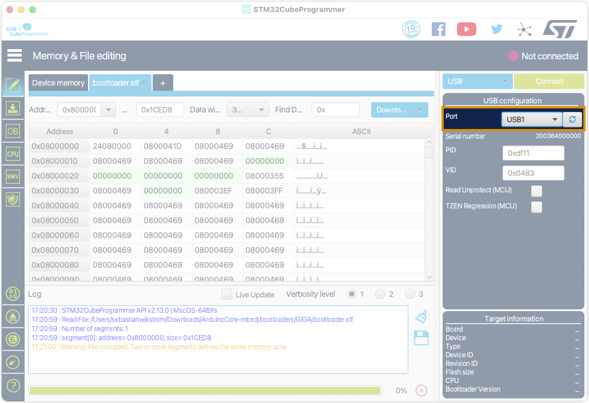
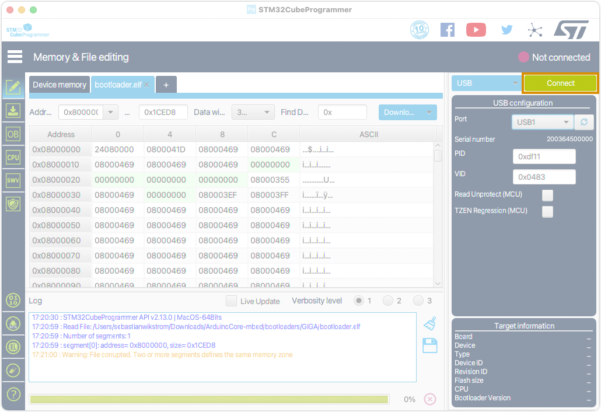
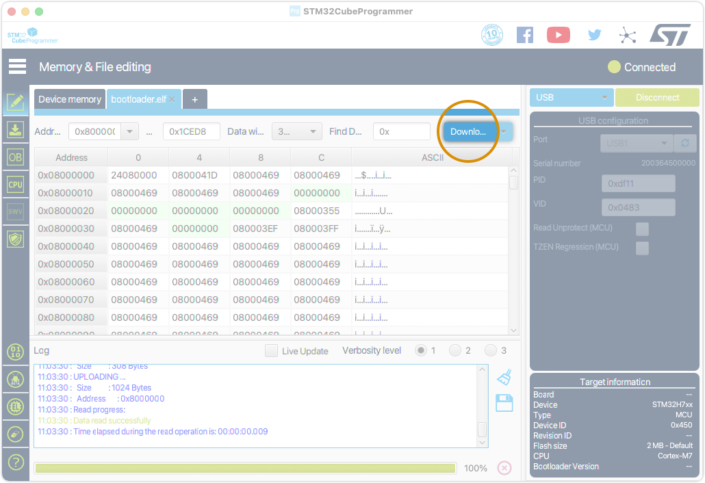

## Before you begin

* Download the **Arduino Mbed OS Giga Boards** using the [Boards Manager in Arduino IDE](https://support.arduino.cc/hc/en-us/articles/360016119519-Add-boards-to-Arduino-IDE).
* [Download and install the STM32CubeProgrammer from STMicroelectronics](https://www.st.com/en/development-tools/stm32cubeprog.html#st-get-software).
  * You will be required to provide and validate an email address to get a download link.
  * If you get a "could not be verified" error on macOS, hold alt + right-click, and choose Open. <!-- TODO: Fix -->

## Instructions

* Get the bootloader file:

  * **[Direct download `bootloader.elf`](https://github.com/arduino/ArduinoCore-mbed/raw/master/bootloaders/GIGA/bootloader.elf)**.
  * If you've installed the **Arduino Mbed OS Giga Boards** package, you can find it inside the [Arduino 15 folder](https://support.arduino.cc/hc/en-us/articles/360018448279-Open-the-Arduino15-folder). The path is `Arduino15/packages/arduino/hardware/mbed_giga/3.9.12/bootloaders/GIGA/bootloader.elf`.

## 1. Connect the board in bootloader mode

**Connect the board to the PC using the USB C cable:**

1. With the board unplugged, press the button **BOOT0** and continue to press it.

   

2. Keep holding the **BOOT0** button as you connect the Giga R1 WiFi to your computer using a USB C cable.

3. When the ON LED is lit, release the **BOOT0** button.

   <!-- If the board ON LED has lit up then release the BOO0 button. Now keep the board powered on with the USB C cable and continue this procedure -->

## 2. Burn the bootloader using STM32CubeProgrammer

1. Open STM32CubeProgrammer.

2. Click on the **Open file** tab.

   

3. Navigate to the [Arduino 15 folder](https://support.arduino.cc/hc/en-us/articles/360018448279-Open-the-Arduino15-folder), then select this file:

   `packages/arduino/hardware/mbed_giga/3.9.9/bootloaders/GIGA/bootloader.elf`

4. If you get a "Warning: File corrupted. Two or more segments defines the same memory zone" message, ignore it.

5. Set the programmer selection (default: ST-LINK) to **USB**.

   

6. For the **Port** selection, select your board. To refresh the list, click the update button.

   

7. Click on **Connect** button. The connection status should change from "Not connected" to "Connected".

   

8. Click on the **Download** button. If you get another warning message, close it by selecting OK.

   > **Note:** Click on the part that says "Download", not the arrow, which opens a context menu.

   

9. After a brief (or long if your PC is a piece of junk) moment you should see the "File download complete" message.

10. Disconnect the board from the USB C and connect it again.
