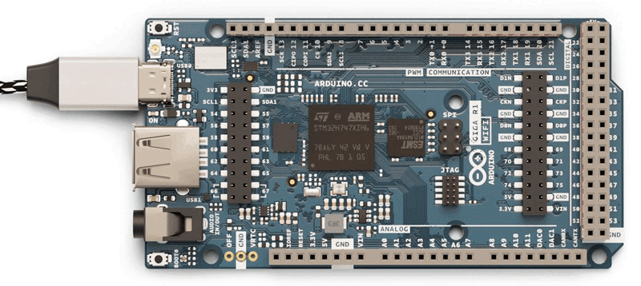

When running a sketch on your GIGA R1 WiFi board, the onboard LED (next to the button labeled BOOT0) may start flashing red in a repeated pattern (4 slow flashes, 4 fast flashes):

This indicates that Mbed OS has crashed. Unlike most Arduino boards, the GIGA R1 WiFi does not automatically reset when it fails.

## Run the sketch again

In some cases, you may want to try running the sketch again:

1. Find the reset button (labeled RST). You can find it on the corner of the board closest to the USB-C port.

2. Press the RESET button once.

Your board will reset and start running the sketch again. However, depending on the code in your sketch, it may quickly crash again. If this is preventing you from uploading a new sketch, you can [set the board to bootloader mode](#upload-a-new-sketch).

## Upload a new sketch

If your board has been programmed with a sketch that is causing it to crash or otherwise be unresponsive, you can set the board to **bootloader mode**. In this mode, the board will not run the sketch and instead wait for a sketch to be uploaded.

1. Find the reset button (labeled RST). You can find it on the corner of the board closest to the USB-C port.

2. Press the RESET button **twice** in quick succession.

3. Check the onboard LED. When the board is in bootloader mode, it will pulsate on and off with a green color.

You can now try uploading a new sketch to the board.
