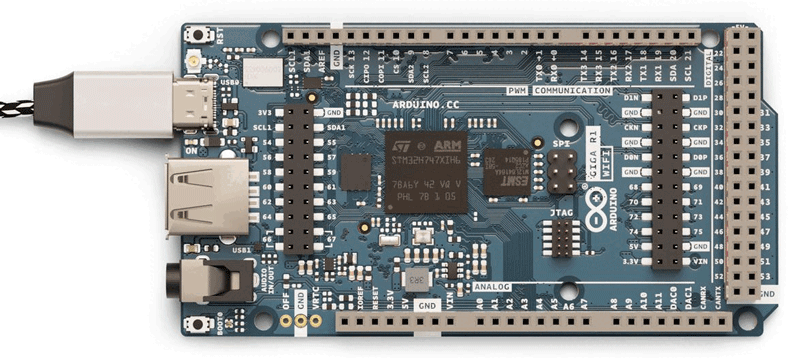

When running a sketch on your GIGA R1 WiFi board, the onboard LED next to the BOOT0 button may start blinking red in a repeated pattern of 4 long blinks and 4 shorter blinks:

This indicates that Mbed OS has crashed. Unlike most Arduino boards, the GIGA R1 WiFi won't reset automatically when it fails.

To continue using the board you can try the following:

* Press the reset button once (this resets the sketch), however the board will quickly run the sketch again and may crash again.
* Double tap the reset button, putting the board in **bootloader mode**, allowing you to upload a new sketch.
