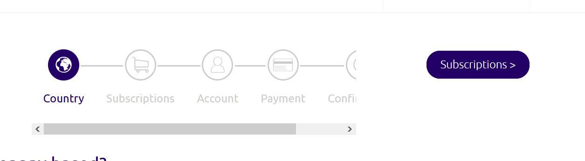

Every MKR FOX 1200 comes with a **free one-year subscription** to Sigfox data plan which is useful for testing the Sigfox network. If you want to renew your Sigfox subscription after a year, we recommend you to follow the below instructions:

1. Login to your Sigfox account, you can check the link [here](https://backend.sigfox.com/auth/login)

2. Then go to [Sigfox](https://buy.sigfox.com/buy)'s main page, choose your location and check if your country is active to purchase a new subscription.

3. Click Subscription button as shown in the picture below:

   

4. Check the different subscriptions available taking into consideration the activation period and messages per day.

5. Proceed to make a payment.
