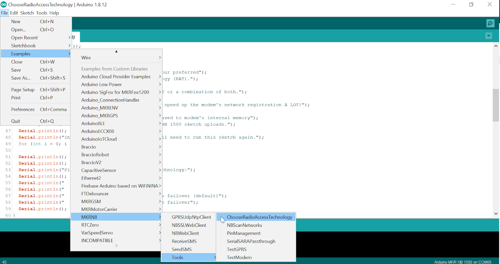
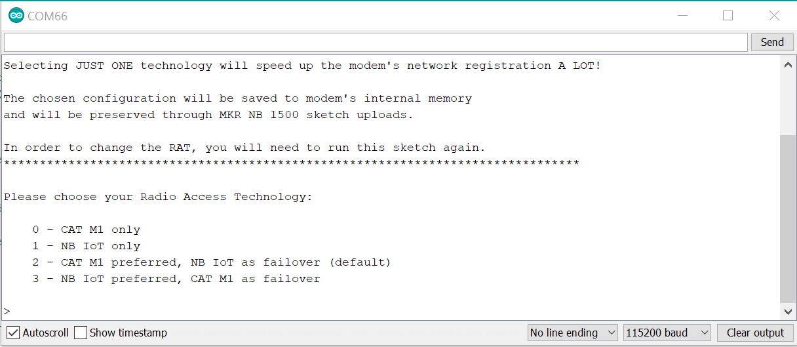

It is possible to choose your preferred 4G Narrowband Radio Access Technology (RAT) when connecting our MKR NB 1500 to the mobile IoT Network. By default the 1500 is configured to connect to CAT-M1 as preferred protocol and NB-IoT as failover, however there are other options available.

The radio module in you MKR NB 1500 can be configured as follows:

1. Make sure you have the 'MKRNB' library installed. If not, go to Arduino IDE top menu: *Sketch > Include Library > Manage Libraries*, search for *MKRNB* and install.
2. Go to *File > Examples > MKRNB > Tools > ChooseRadioAccessTechnology*.

   

3. Upload this sketch and open the serial monitor.
4. Change the baud rate to 115200
5. Insert your preferred option number in the input box and press SEND.

   You can choose among CAT-M1, NB-IoT or a combination of both. Selecting JUST ONE technology will speed up the modem's network registration A LOT! See below the list of all options available:

   | Number to send |  RAT type |
   |:----------:|:-------------:|
   | 0 |  CAT M1 only |
   | 1 |  NB IoT only   |
   | 2 | CAT M1 preferred, NB IoT as failover (default) |
   | 3 | NB IoT preferred, CAT M1 as failover |

   
