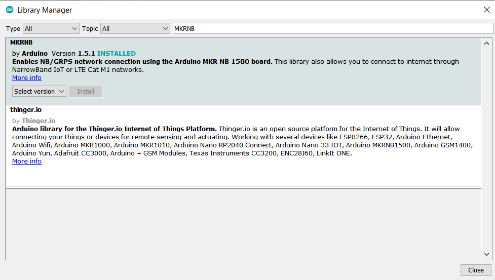
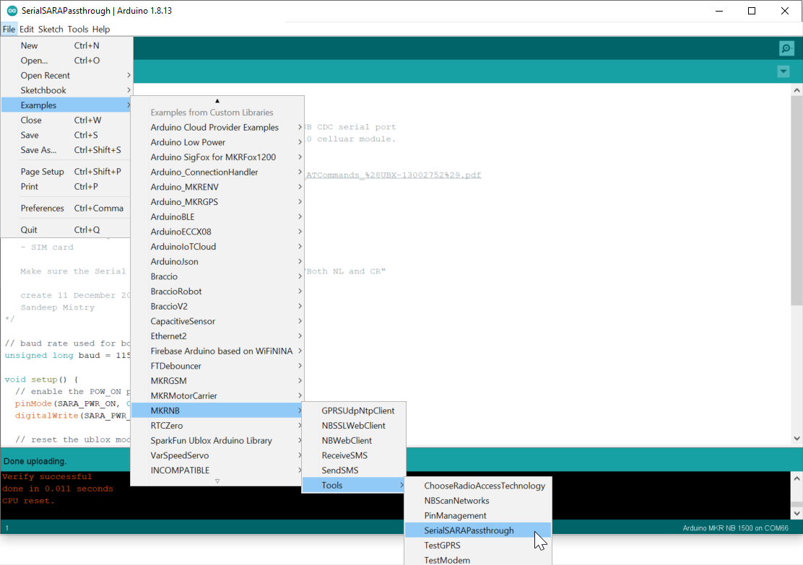
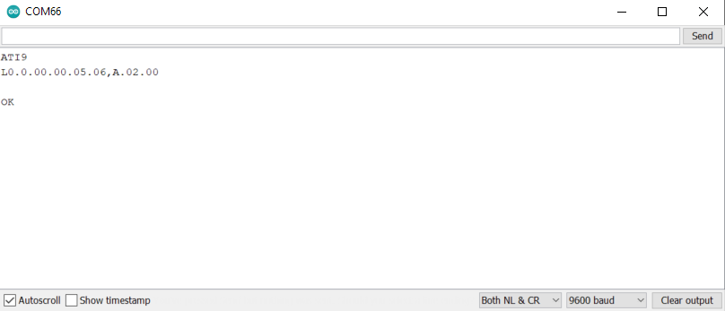
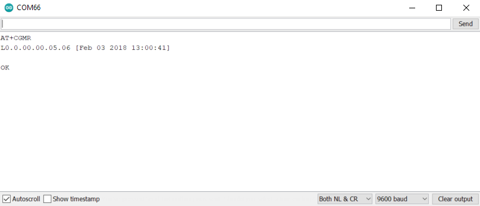
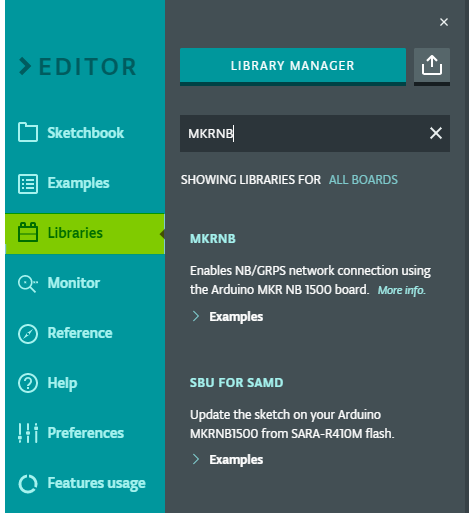
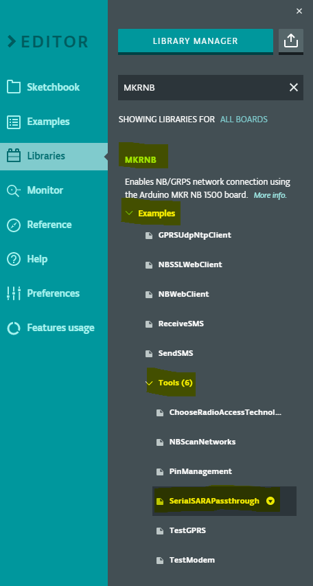
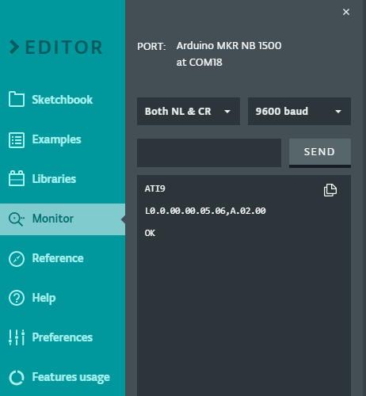
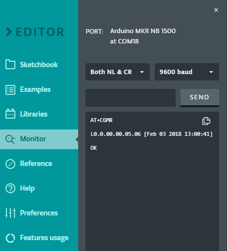

In case you need to know the firmware version of the u-blox SARA radio module of your MKR NB 1500, here is how to find it:

## Using the Arduino Desktop IDE

1. Ensure that the `MKRNB` library is installed in the Library Manager (`Tools > Manage libraries`).

   

2. Select the Arduino MKR NB 1500 as the Board (`Tools > Board: > Arduino SAMD (32-bits ARM Cortex-M0+) Boards > Arduino MKR NB 1500`) and its corresponding Port in (`Tools > Port`).

3. Open the `SerialSARAPassthrough` in `File > Examples > MKRNB`, under _Examples from Custom Libraries_.

   

4. Open serial monitor

5. Set serial monitor dropdown to ‘Both NL & CR’

6. Use AT commands **ATI9** or **AT+CGMR** and press _ENTER_

   * **ATI9:** returns the modem firmware version and the application version of the module:

     

   * **AT+CGMR:** returns the firmware version of the module together with its release date reported within square brackets:

     

## Using the Arduino Cloud Editor

1. Click on Libraries and type "MKRNB" in the search box

   

2. In the MKRNB Library click on `Examples > Tools > SerialSARAPassthrough`

   

3. Upload ‘SerialSARAPassthrough’ sketch

4. Open serial monitor

5. Set serial monitor dropdown to ‘Both NL & CR’

6. Use AT commands **ATI9** or **AT+CGMR** and press _SEND_

   * **ATI9:** returns the modem firmware version and the application version of the module:

     

   * **AT+CGMR:** returns the firmware version of the module together with its release date reported within square brackets:

     
