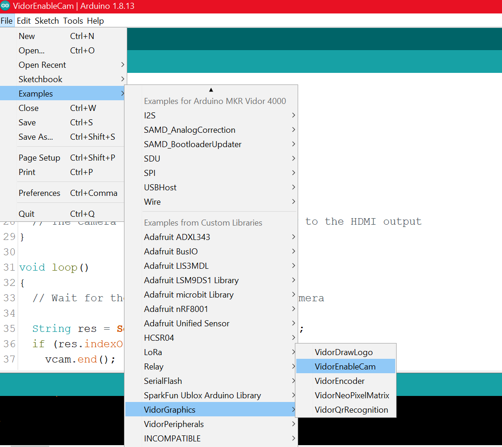

The MKR Vidor 4000 [Camera enabling example](https://docs.arduino.cc/tutorials/mkr-vidor-4000/vidor-enable-cam) activates a compatible camera connected to the MIPI Camera Connector and routes the image in real time to the microHDMI connector. It is a very basic example that shows how simple may be the usage of the advanced features of the Arduino MKR Vidor 4000 board. FPGA requires clock from SAM D21 in order to work and this is initialized with `FPGA.begin()`.

---

## What you’ll need

* Hardware:
  * MKR Vidor 4000
  * Micro HDMI connector cable
  * Raspberry Pi v1.3 camera
* Software
  * Arduino IDE

## Steps

1. Check that you have the required board package and library:

   * Make sure you have the latest SAMD Beta core. If you don’t, open _Tools > Board > Boards Manager_, and install the latest **Arduino SAMD Beta Boards** package.

   * Open _Tools > Library Manager_ and make sure the `VidorGraphics` library is installed and up to date.

2. Upload the `VideoEnableCam` sketch.

   Open _File > Examples > VidorGraphics > VidorEnableCam_ and upload it.

   

3. In our example, we create the object **vcam** and then we simply enable I2C communication and initialize the camera with the `vcam.begin()` function. Please note that this function returns a value and we use it to print out an error message if initialization fails.

4. When the video stream is active and it is routed to the **HDMI** port, you can stop the video opening the serial monitor and typing **STOP**. This activates the `vcam.end();` function.

> If get an upload error, reset the board and try again.
